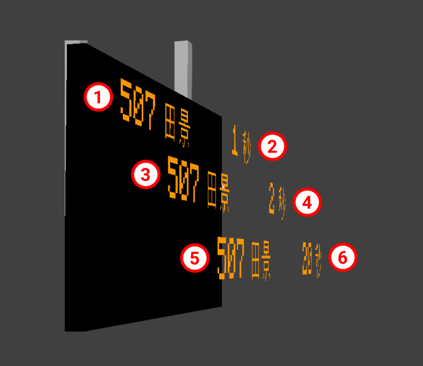

# MTR 3 PIDS 移植说明 —— JCM 2.x / MTR 4.0 的 PIDS 体系 → YJCM / MTR 3

本分支把 **JCM（Joban Client Mod）2.x / MTR 4.0** 的 PIDS 体系移植到
**YJCM / MTR 3（YMTR 3.6.3，MC 1.20.1）**，包含两个子系统：

| 子系统 | 来源（JCM 2.x） | 本分支实现 |
|---|---|---|
| **组件化布局预设** | `jcm/mod/data/pids/*` + `PIDSComponent` 组件树 | `com.jsblock.pids.*`，11 种组件，JSON 声明式版式 |
| **JavaScript 脚本预设** | `jcm/mod/scripting/pids/*` + `mtrscripting` + Rhino | `com.jsblock.script.*`，内置 Rhino 1.7.15，可直接跑 JCM 2.x 的 `.js` 预设 |

两个子系统共用同一条预设入口：资源包里的 PIDS 预设 JSON 里写 `components`
就走组件布局，写 `scriptFiles` 就走 JS 脚本，两者都不写则完全沿用 YJCM 原有的
硬编码渲染路径（**向后兼容**）。

---

## 1. 为什么要移植

移植前，YJCM 与 JCM 在 PIDS 上的差距是**架构性**的：

| | YJCM（移植前） | JCM 2.x（MTR 4.0） |
|---|---|---|
| 布局 | 每个元素位置**硬编码**在 `RenderLCDPIDS` / `RenderRVPIDS` 里 | `PIDSComponent` 声明式布局（`x/y/width/height`） |
| 可扩展性 | 想改版式只能改 Java、重新编译 | 资源包写 JSON / JS 即可换版式 |
| 组件类型 | 无 | 11 种（时钟 / 天气 / 站名 / 目的地 / ETA / 车厢数 / 自定义文本 / 自定义贴图 / 轮播 …） |
| 脚本 | 无 | Rhino JS，脚本自己画整块面板 |

YJCM 已有预设系统（`com.jsblock.data.PIDSPreset`，从 `JobanCustomResources` 载入，
支持到站/离站自动切换、`{time}`/`{weather}` 变量替换），但它描述的是**外观**，
不是**版式**，更不能让预设自己决定画什么。本分支补上的正是这两层。

---

## 2. 新增模块

### 2.1 组件化布局（`com.jsblock.pids`）

```
common/src/main/java/com/jsblock/pids/
├── PIDSContext.java      渲染一帧所需的全部数据快照
├── PIDSGraphics.java     渲染状态打包（PoseStack / MultiBufferSource / 光照 / 颜色 / 字体）
├── PIDSGeometry.java     面板几何（位置、缩放、尺寸），由各渲染器提供
├── PIDSComponent.java    组件基类 + 组件注册表 + 共享绘制助手
├── ComponentParser.java  组件工厂函数式接口
├── PIDSAlign.java        JSON 对齐/颜色解析助手
├── PIDSData.java         MTR 3 客户端数据只读门面
├── PIDSLayout.java       预设解析 + 整版渲染
└── component/            11 个组件实现（clock / weather_text / weather_icon /
                          custom_text / custom_texture / cycle / platform_text /
                          station_name / arrival_destination / arrival_eta / arrival_car）
```

### 2.2 JavaScript 脚本预设（`com.jsblock.script`）

```
common/src/main/java/com/jsblock/script/
├── ScriptEngine.java           Rhino 作用域、全局对象、脚本解析与实例缓存、include()
├── ScriptDrawCalls.java        Text / Texture / Rectangle 三条构建链
├── ScriptDrawCall.java         绘制调用基类（pos / size / zOrder）
├── ScriptRenderContext.java    绘制上下文；dryRun() 供无头检查记录调用而不真的画
├── PIDSWrapper.java            暴露给脚本的 pids / arrivals / arrival / route / station / platform
└── ScriptTextures.java         贴图解析（JCM 2.x 的贴图加载语义）

common/src/main/resources/assets/jsblock/scripts/
├── pids_util.js                       PIDSUtil 工具函数（与 JCM 2.x 同名同内容）
└── builtin/pids_1a.js                 随 mod 附带的 1A 预设（JCM 2.x 脚本写法）
```

### 2.3 改动的既有文件

| 文件 | 改动 |
|---|---|
| `common/.../data/PIDSPreset.java` | 新增可空字段 `layout` / `scriptFiles` / `blacklist` / `name` / `builtin`；`fromJson` 解析 `components` 与 `scriptFiles`。**旧预设行为完全不变。** |
| `common/.../render/RenderPIDSBase.java` | 新增三条路径的分发：脚本 → 布局 → 内置；新增 `getLayoutGeometry()`、`renderScripted()`、`renderLayout()` 与面板字面量钩子 |
| `common/.../render/RenderLCDPIDS.java` | 实现 `getLayoutGeometry()`，覆写 LCD 的 JCM 2.x 面板字面量 |
| `common/.../block/PIDS1A.java` | 父类上移到 `JobanPIDSBase`，接入预设存储与配置界面 |
| `common/.../JobanClient.java` | 1A 改用 `RenderRVPIDS` 并对该实例应用 1A 的面板字面量 |
| `gradle.properties` | 新增 `rhino_version=1.7.15`；按离线构建需要固定各依赖版本 |
| `forge/.../mappings/ForgeConfig.java` | **新建**（原仓库缺失该文件，见 §5.1） |
| `fabric/build.gradle`、`forge/build.gradle` | `classifier` → `archiveClassifier`（见 §5.2） |

---

## 3. 预设 JSON 格式（组件布局）

放进资源包的 PIDS 预设仍是原来的 JSON；加一个 `components` 数组即可启用组件布局：

```json
{
  "id": "hk_example",
  "background": "jsblock:textures/block/pids_rv_screen.png",
  "size": [100, 50],
  "color": "FFFFFF",
  "font": "mtr:mtr",
  "components": [
    { "component": "station_name",        "x": 2,  "y": 2,  "width": 46, "height": 8, "prefix": "往 " },
    { "component": "clock",               "x": 80, "y": 2,  "width": 18, "height": 8, "format": "HH:mm" },
    { "component": "arrival_destination", "x": 4,  "y": 14, "width": 62, "height": 8, "row": 0 },
    { "component": "arrival_eta",         "x": 80, "y": 14, "width": 18, "height": 8, "row": 0 },
    { "component": "arrival_car",         "x": 80, "y": 24, "width": 18, "height": 6, "row": 0,
      "only_when_varying": true },
    { "component": "cycle", "x": 2, "y": 36, "width": 96, "height": 10, "interval": 100, "components": [
        { "component": "weather_text", "x": 0,  "y": 0, "width": 48, "height": 10 },
        { "component": "custom_text",  "x": 0,  "y": 0, "width": 96, "height": 10,
          "text": "第 {day} 天 · {worldPlayer} 人在线" }
    ]}
  ]
}
```

- **`size`**：设计画布尺寸（默认 `[100, 50]`）。所有组件的 `x/y/width/height` 都用这套
  设计单位；渲染时整块画布**等比**缩放到面板上，因此同一份预设在小尺寸站台 PIDS 和
  大尺寸投影仪上表现一致。
- **`color` / `font`**：与旧预设含义相同，作为组件未单独指定颜色/字体时的默认值。
- **`background`**：可选。带布局的预设会**自己绘制**背景图（内置渲染器的背景绘制被绕过，
  所以这一层由布局路径补上）；不写则只有组件。
- 旧预设（无 `components`）继续走原有硬编码渲染路径，**完全向后兼容**。

### `row` 的语义：显示行，不是班次下标

`arrival_*` 组件的 `row` 是**显示行号**，采用与内置渲染器（`RenderLCDPIDS` /
`RenderRVPIDS`）完全一致的规则：

> 被 `hideRow` 标记为隐藏的行**不消耗**班次，因此该班次会顶到下一个可见行。

所以 `row: 2` 指的始终是用户在屏幕上看到的第 3 行，与预设隐藏了几行无关。

### 随 mod 附带的示例预设

`common/src/main/resources/assets/jsblock/joban_custom_resources.json` 内置了三个可直接使用的布局预设，
同时也是本引擎的活体测试用例：

| id | 演示内容 |
|---|---|
| `layout_lcd` | 复刻内置 LCD PIDS：站名 + 时钟表头，4 行「终点站 + ETA」 |
| `layout_rv` | 复刻内置 RV PIDS，并补上内置渲染器只在特定 tick 闪现的**车厢数** |
| `layout_notice` | 演示 `cycle` 组件：天气 / 日期 / 在线人数三屏轮播 |

### 通用选项（所有组件）

| 键 | 说明 |
|---|---|
| `halign` | `left` / `center` / `right`（默认随组件而定） |
| `valign` | `top` / `center` / `bottom` |
| `color` | `RRGGBB` 或 `AARRGGBB` 十六进制 |
| `scale` | 文本缩放倍数，默认 `1` |

### 各组件专属选项

| 组件 | 专属键 |
|---|---|
| `clock` | `format`（默认 `HH:mm`，支持 `ss`）、`seconds` |
| `weather_text` | `sunny`、`raining`、`thundering`（文案覆盖） |
| `weather_icon` | `sunny_texture`、`raining_texture`、`thundering_texture`、`tint`、`translucent` |
| `custom_text` | `text`（必需）、`use_variables`（默认 `true`） |
| `custom_texture` | `texture`（必需）、`tint`、`translucent` |
| `cycle` | `interval`（tick，默认 `100`）、`components`（子组件数组） |
| `platform_text` | `prefix`、`fallback` |
| `station_name` | `prefix`、`use_mtr_formatting`（默认 `true`） |
| `arrival_destination` | `row`（默认 `0`）、`show_route_name` |
| `arrival_eta` | `row` |
| `arrival_car` | `row`、`only_when_varying` |

---

## 4. JavaScript 脚本预设

一个 JCM 2.x 的脚本预设，在 YJCM 里**不需要任何改动**即可运行。预设 JSON 声明脚本文件：

```json
{
  "id": "nanbin_crt_pids_1",
  "name": "CRT PIDS (Style 1)",
  "builtin": true,
  "background": "nanbin:pids/image/crt_pids_1.png",
  "fonts": "nanbin:harmonyos_sanssc_medium",
  "scriptFiles": ["nanbin:pids/script/crt_pids_1.js"],
  "blacklist": ["pids_1a"]
}
```

脚本从 `assets/<namespace>/<path>` 读取，位置与 JCM 2.x 完全一致。

### 4.1 脚本生命周期

```js
function create(ctx, state, pids)  { }   // 面板首次出现时调用一次
function render(ctx, state, pids)  { }   // 每帧调用，在这里 draw
function dispose(ctx, state, pids) { }   // 面板消失时调用
```

`state` 是一个每块面板独立的空对象，用来存放脚本自己的状态（轮播计时器等）。
**每块 PIDS 方块位置有独立的脚本实例**，同一面板的两半不会共用状态。

### 4.2 注册的全局对象

| 全局 | 作用 |
|---|---|
| `Text` / `Texture` / `Rectangle` | 三条绘制构建链，见 §4.3 |
| `Resources.id("namespace:path")` | 引用资源 |
| `include(Resources.id("...:....js"))` | 把另一份脚本并入当前作用域（JCM 2.x 的依赖写法） |
| `TextUtil` | `cycleString(text[, ticks])`、`getCjkParts` / `getNonCjkParts` / `getExtraParts` / `getNonExtraParts` / `getNonCjkAndExtraParts`、`isCjk` |
| `MinecraftClient` | `worldDayTime()`、`worldIsRaining()`、`worldIsThundering()` |
| `RateLimit(seconds)` | 新建一个限流器：`shouldUpdate()` / `resetCoolDown()` |
| `print(...)` | 输出到游戏日志（`[PIDS script]` 前缀） |

`PIDSUtil`（`formatTime` / `getETAText` / `getCarText` / `formatDateTime`）**由 JS 提供**，
随 mod 附带在 `assets/jsblock/scripts/pids_util.js`，与 JCM 2.x 的自带文件同名同内容——
预设用 `include(Resources.id("jsblock:scripts/pids_util.js"))` 引入即可。

### 4.3 绘制构建链

```js
Text.create("Clock").text("06:00").color(0xFFFFFF).pos(124, 6).scale(0.8).rightAlign().draw(ctx);

Texture.create("Background")
    .texture("nanbin:pids/image/crt_pids_1.png")
    .size(pids.width, pids.height)
    .draw(ctx);

Rectangle.create("Bar").color(0xFF0000).pos(0, 0).size(100, 4).draw(ctx);
```

`Text` 支持 `scale` / `leftAlign` / `centerAlign` / `rightAlign` / `shadowed` / `stretchXY` /
`scaleXY` / `wrapText` / `marquee` / `marquee(ticks)` / `withMarqueeProgress` / `lineHeight` /
`fontMC` / `font(id)` / `renderType` / `italic` / `bold` / `color` / `naturalLight` / `measureWidth`。
`Texture` 支持 `texture` / `uv` / `color` / `naturalLight` / `renderType`。
三条链都支持 `pos(x, y)`、`size(w, h)`、`zOrder(n)`。

#### `.color()` 写的是 RGB，透明度由引擎补

预设里写的永远是 6 位十六进制（`0xFFFFFF`、`0x874936`），**没有 alpha 通道**，而
MTR 3 的 `IDrawing.drawTexture` 的 alpha 直接取 `color >> 24`。所以 `.color()` 一律按
JCM 2.x 的做法补成不透明（JCM 2.x 写 `ARGB_BLACK + color`，这里用 `|`，对任何
小于 `0x01000000` 的值等价，且不会把默认的 `ARGB_WHITE` 加到 `0xFFFFFFFE`）。

不补会怎样，是这一轮实机才看清的：

| 现象 | 原因 |
|---|---|
| 车厢数/路号徽章只有白字，没有底色 | `white.png` 的 tint alpha 为 0 → 整块透明 |
| 站台圆圈只剩里面的数字 | 同上，`plat_circle.png` 的 tint 同样透明 |
| 路线图有站名和箭头，唯独**没有那条线和站点圆点** | 线和圆点也是带 tint 的贴图 |

**文字为什么看起来没事**：原版字体渲染器自己会补 alpha
（`if ((color & 0xFC000000) == 0) color |= 0xFF000000`），贴图这条路没人补。
这个不对称正是它容易被误判成「颜色值不对」而不是「根本没画出来」的原因。

JSON 组件那条路本来是对的（`PIDSAlign.color` 把 6 位色变成 `0xFF000000 | value`），
脚本这条路此前漏了。

### 4.4 脚本能读到的数据（`pids`）

| 成员 | 说明 |
|---|---|
| `pids.width` / `pids.height` | 画布尺寸（JCM 2.x 的 1/96 方块单位） |
| `pids.type` / `pids.name` / `pids.id` | 面板类型与预设标识 |
| `pids.blockPos()` / `pids.targetPlatformIds()` | 方块坐标与绑定的站台 |
| `pids.getCustomMessage(i)` / `pids.isRowHidden(i)` | 自定义文本与行隐藏标记 |
| `pids.isKeyBlock()` / `pids.isPlatformNumberHidden()` | 本块是不是面板的「主块」；平台号显示是否被关掉 |
| `pids.station()` | `name()` / `getName()` / `id()` / `zone()` / `stationName()` |
| `pids.arrivals()` | `get(i)`（越界返回 `null`，与 JCM 2.x 一致）、`size()`、`mixedCarLength()`、`toArray()`、`platforms()` |
| `arrival.*` | `arrivalTime()` / `departureTime()` / `arrived()` / `departed()` / `destination()` / `carCount()` / `routeNumber()` / `routeName()` / `routeColor()` / `circularState()` / `platformName()` / `currentStationIndex()` / `deviation()` / `realtime()` / `cars()` / `terminating()` / `platform()` / `route()` |
| `arrival.route()` | `getPlatforms()` → `size()` / `get(i)` → `getStationName()` / `getPlatformId()` |

> `pids.arrivals().get(i)` **越界返回 `null`**，这是 JCM 2.x 的正式契约（它自己的
> `pids_1a.js` 就是这么守的）。没有任何班次时脚本必须自己判空。
>
> 这一条**必须是 `null`，不能是「占位对象」**。曾经为了让不判空的预设不抛异常而返回过
> 占位对象，代价是预设那侧完全看不出来：`if (train)` 恒为真，于是所有**写了**判空的预设
> 都会把空行画出来。在 HKR 的面板上，那个幽灵班次走到 `isNonPassenger`——占位对象没有
> 线路，函数返回「非载客」——于是打出「不載客列車」，而它的 ETA 永远显示「1 min」：
> 占位对象报的到站时间是**当下**，`Math.ceil(0 / 60)` 进位成 1 分钟，而这句话每 60 tick
> 在中英之间切换一次，就是它旁边那个「闪烁」。
>
> **不判空的预设由引擎兜底，不用改资源包。** 返回 `null` 会让不判空的预设抛异常——这正是
> JCM 2.x 里会发生的事（重庆轨道交通包的 `crt_pids_1.js` 第 20、22 行就是这种写法，站台
> 只有 1 班车时必抛）。资源包不归我们改，所以引擎改成：`render()` 抛出的异常里**提到 null**
> 时，把那块面板换成「越界给占位对象」的语义重试一帧，成功就把这个选择固定下来（只重试一次，
> 不是每帧）。重试前会先把每调用深度计数归零，让重发的那批调用落在**第一次尝试用过的深度**上，
> 而不是在它后面再叠一层。
>
> 两种结果分开告知，因为它们不是一回事：
>
> | 结果 | 日志 | 聊天栏 |
> |---|---|---|
> | 重试画出来了 | 保留那条 ERROR（给预设作者看）+ 一条「已用占位班次绘制」的 WARN | 只有一条黄字说明 |
> | 重试也没画出来（那个 null 根本不是班次） | 保留 ERROR | 只有那条红字，**不会**谎称已救回 |
>
> 实机两种情况都碰到了：CRT 面板在 0 班次站台上正常出图；`sound_transit.js` 死在
> `pids.station()` 为空（与班次无关），照实报红字并退回预设背景图。

### 4.5 画布尺寸与面板字面量

脚本坐标单位是 JCM 2.x 的 **1/96 方块**，画布尺寸是每种 PIDS 型号的硬编码字面量——
脚本作者就是照这些数字排版，所以必须逐字照抄，不能从面板尺寸反推：

| 渲染器 | JCM 2.x `translate` | 画布 |
|---|---|---|
| `RVPIDSRenderer` | `(-0.21, -0.14, -0.128)` | 136 × 76 |
| `PIDS1ARenderer` | `(-0.47, -0.155, -0.130)` | 186 × 60 |
| `LCDPIDSRenderer` | `(-0.19, -0.125, -0.130)` | 133 × 72 |

Z 值另外按实机观感微调过（面板要离开方块表面，否则会与方块模型争深度）：
RV 与 LCD 见 `RenderPIDSBase` / `RenderLCDPIDS`，1A 为 `-0.112`（在 JCM 2.x 的
`-0.130` 基础上向方块内侧收回 0.018）。

### 双格面板：两半各画一面

一个「双格」PIDS 其实是**两个方块背靠背**：`BlockPIDSBaseHorizontal.setPlacedBy` 把第二块
放在 `pos.relative(FACING)`，并给它**相反的 FACING**。于是：

| | 朝向 | 角色（JCM 2.x 的叫法） |
|---|---|---|
| 主块 | `NORTH` / `EAST` | key block，`pids.isKeyBlock()` == `true` |
| 另一块 | `SOUTH` / `WEST` | `pids.isKeyBlock()` == `false` |

**两半都要渲染**，各自在自己那一面画一整块面板——JCM 2.x 的 `PIDSRenderer.renderCurated`
里**没有**任何 key-block 判断，它就是「谁被调到就从谁那里、以谁为原点画」；MTR 3 自带的
`RenderPIDS` 同理。曾经有一版把非主块 `return` 掉，结果每块双格面板**只剩一面有画面**。

哪一半真的出图由**预设自己**决定，工具是 `pids.isKeyBlock()`。1A 型的
`st_ql.js`（琼岭车站展示系统）就是这么写的：

```js
if (pids.isPlatformNumberHidden()) {
    if (!pids.isKeyBlock()) { show(pids, ctx); }   // 平台号隐藏 → 画在非主块那面
} else {
    if ( pids.isKeyBlock()) { show(pids, ctx); }   // 平台号可见 → 画在主块那面
}
```

所以 `isKeyBlock()` / `isPlatformNumberHidden()` 一度被硬编码成 `true` / `false` 时，
这块面板在「平台号可见」时两半都画（日志里同一块面板出现两次 `running script`），
在「平台号隐藏」时**一面都不画**。

两半共用一份编译好的脚本程序（按主块位置做 key），因此预设里的计数器、音效状态每块面板
只有一份，两半不会各自跑一套。`pids.getCustomMessage(i)` 与 JCM 2.x 一样，越界给空串。

### 4.6 脚本沙箱与可见性（JCM 2.x 真有的那部分 GUI）

**JCM 2.x 并没有 PIDS 脚本文本编辑器。** PIDS 预设在那里也是资源包文件、运行时只读；
它的 `mtrscripting/mod/gui/` 下是 EyeCandy（MTR 4 独有的积木方块）的配置界面，而
`PIDSPresetScreen` 只是预设选择列表（等价物 YJCM 本来就有）。所以这里移植的是
JCM 2.x 围绕脚本真正具备的四件东西：

| 本分支 | JCM 2.x 对应物 | 作用 |
|---|---|---|
| `ScriptClassShutter` | `MTRClassShutter` | Rhino 类访问白名单。预设来自资源包，资源包来自服务器与整合包，**预设是不可信代码**——没有它，`java.nio.file.Files` 离脚本只有一次调用 |
| `ScriptRestrictionWarningScreen` | 同名 | 关闭限制前的确认界面，只在「关闭」这个方向弹出 |
| `ScriptErrorNotifier` | 同名 | 失败的面向玩家投递队列 |
| `ScriptDebugOverlay` | `MTRScriptDebugOverlay` | 调试浮层：存活脚本实例、方块坐标、执行耗时、哪一个在抛异常 |

**为什么失败提示要排队而不是直接发聊天栏**：脚本是在方块实体渲染里抛的，那时渲染线程
正在出帧，而且那块方块玩家可能根本看不见。所以失败在发生处写日志，面向玩家的那一半
入队，由客户端 tick 投递。

**为什么失败提示默认开着**：JCM 2.x 把它绑在调试开关上，结果是唯一需要它的人（预设坏了、
面板全黑的普通玩家）反而看不到。这里它是独立开关，默认开。

白名单是 JCM 2.x 的，包名从 `com.lx862.mtrscripting` 换到 `com.jsblock.script`；
deny 规则只在 allow 规则命中之后才查，所以 `java.lang.*` 可以放行而
`java.lang.System`、`java.lang.Class` 仍不可及。

> **无头检查在这里立刻见效**：ClassShutter 一打开，16 个用例**全部**失败，报
> `Access to Java class "net.minecraft.resources.ResourceLocation" is prohibited`。
> `Resources.id()` 返回这个类型，而 Rhino 连返回值包装也要过白名单——连随 mod 附带的
> `pids_util.js` 都加载不了。修法是**精确放行这一个类**并写明理由，而不是为了省事放开
> 整个 `net.minecraft.*`（那等于把 Minecraft 的文件与网络访问一并交给脚本）。

配置项（`config/jsclient.json`，配置界面里可切换）：

| 键 | 默认 | 说明 |
|---|---|---|
| `scriptErrorNotifications` | `true` | 脚本抛异常时在聊天栏提示 |
| `scriptDebugMode` | `false` | 绘制脚本调试浮层 |
| `scriptRestrictionsDisabled` | `false` | 关闭类访问限制（会先弹警告界面） |

---

## 5. 顺带修复的三个上游缺陷

移植过程中发现 YJCM 公开仓库本身**编不过**，以下问题与本分支的功能无关，但必须修复。

### 5.1 缺失 `ForgeConfig.java`

`forge/src/main/java/com/jsblock/JobanForge.java` 引用了 `com.jsblock.mappings.ForgeConfig`，
但该文件**从未被提交**——它位于 `com.jsblock.mappings` 这个由 `setupFiles` 任务生成、
且未被 `.gitignore` 覆盖却也没进版本控制的目录里。`setupFiles` 下载的
`Minecraft-Mappings-1.20.zip` 里只有 `FabricRegistryUtilities.java` 和 `ForgeUtilities.java`，
不含 `ForgeConfig`。

已按其在 Fabric 侧的对等物 `ModMenuConfig` 还原：把 YJCM 的 `ConfigScreen`
注册为 Forge 的配置界面扩展点（`ConfigScreenHandler.ConfigScreenFactory`）。

### 5.2 Gradle 8 不兼容

`fabric/build.gradle` 与 `forge/build.gradle` 使用了 `classifier`，该 API 在 Gradle 8.0
已被移除（项目原本面向 Gradle 7）。已改为等价的 `archiveClassifier`。

### 5.3 `font` / `fonts` 键不一致

上游 `PIDSPreset.fromJson` 读的键是 **`fonts`（复数）**，而字段和所有渲染器都叫
`font`。资源包写 `font` 时字体被静默丢弃。现在两个键都接受。

---

## 6. 构建

```powershell
$env:JAVA_HOME = 'C:\Program Files\Zulu\zulu-21'
$gradle = "$env:USERPROFILE\.gradle\wrapper\dists\gradle-8.8-bin\dl7vupf4psengwqhwktix4v1\gradle-8.8\bin\gradle.bat"
cd work\yjcm-mtr3
& $gradle build --no-daemon --console=plain --max-workers=1
```

### 6.1 MTR 3 编译依赖从哪来

MTR 官方的开发 jar（`MTR-common-1.20-*-dev.jar`）下载地址**已经全面 404**，
`storage.zbx1425.cn` 的 `latest` 路径同样 404。解决办法是利用本机 Gradle 缓存中已有的
**YMTR 3.6.3 经 ForgeGradle 反混淆后的 Mojang 映射版 jar**：

```
~/.gradle/caches/forge_gradle/deobf_dependencies/maven/modrinth/ymtr/
    1.20.1-3.6.3_mapped_official_1.20.1/ymtr-1.20.1-3.6.3_mapped_official_1.20.1.jar
```

把它复制成 `checkouts/1.20/mtr-common.jar`（以及 `mtr-fabric.jar` / `mtr-forge.jar`）即可。
已核对 YJCM 需要的 **65 个 MTR 类全部存在**。注意 `fabric` 与 `forge` 子模块本身
**不依赖 MTR**——MTR 只是 `common` 模块的 `files(...)` 依赖。

### 6.2 离线配置

`gradle.properties` 把 `architectury_version` / `fabric_loader_version` / `fabric_api_version` /
`forge_version` / `mod_menu_version` 全部固定，`build.gradle` 只在缺少这些值时才去查
Modrinth / Fabric meta / Forge promotions。这样配置阶段不需要网络。

> `setupFiles` 仍会尝试下载 `Minecraft-Mappings/1.20.zip`，失败时 `build.gradle` 会打印
> 一整段堆栈再继续——**那段堆栈不是构建失败**，是它的 `catch` 分支在 `printStackTrace()`。

### 6.3 Gradle 代理

`~/.gradle/gradle.properties` 里曾把 Gradle 指向 FlClash 的 `127.0.0.1:7890`。该端口
失效后，`architectury-plugin:3.4-SNAPSHOT` / `loom:1.0-SNAPSHOT` 这类**动态版本**的
依赖解析会带着退避反复重试，构建看起来像是卡死在 `:forge:compileJava`（实测 20 分钟
无输出，线程停在 `ErrorHandlingModuleComponentRepository...listModuleVersions`）。
直连可达时已把代理配置注释掉，并把 `max.tentatives` 从 10 降到 3。

---

## 7. 验证状态（务必阅读）

### 7.1 一条命令跑完全部无头检查

```powershell
powershell -NoProfile -ExecutionPolicy Bypass -File tools\run-pids-check.ps1
```

它会：构建 → 导出 `:common` 运行时 classpath → 用 `javac` 编译 `tools/checks/` 下的两个
检查 → 运行它们。任何一步失败都以非零码退出。

| 检查 | 覆盖内容 |
|---|---|
| `PIDSPresetCheck` | 三个附带布局预设的解析（逐条打印组件树）、未知组件的降级、**显示行映射**语义（4 组用例比对内置渲染器的推进规则） |
| `ScriptShutterCheck` | 脚本沙箱。24 条白名单/黑名单断言，再用**真实引擎作用域**去够四个被禁类（见 §7.7） |
| `ScriptApiCheck` | 真实 JCM 2.x 脚本经真实包装对象跑完整生命周期。除 GPU 绘制外全部真跑：Rhino 编译、`include()`、全局对象、`Text`/`Texture`/`Rectangle` 构建链。`ScriptRenderContext.dryRun()` 记录绘制调用而不是真的画 |

沙箱检查排在脚本检查**之前**：白名单若写错，下面每个脚本要么被拦住、要么毫无防护，
先看到沙箱那一块就能直接定位，不必从 16 个脚本失败里反推。

`ScriptApiCheck` 默认对随 mod 附带的 `pids_1a.js` 跑 **0 / 1 / 2 / 4 四种班次数**
（0 是空站台，4 超过所有 PIDS 的行数），并且每个用例跑 2 帧以捕捉状态漂移。

### 7.2 把资源包预设也纳入检查

```powershell
powershell -NoProfile -ExecutionPolicy Bypass -File tools\run-pids-check.ps1 `
    -ResourceRoot ..\..\yjcm-recon\hkr, ..\..\yjcm-recon\pids-fixed `
    -Script `
      ..\..\yjcm-recon\hkr\assets\jsblock\scripts\hkr_pids_default.js, `
      ..\..\yjcm-recon\hkr\assets\jsblock\scripts\hkr_pids_platform.js, `
      ..\..\yjcm-recon\pids-fixed\assets\nanbin\pids\script\crt_pids_1.js
```

### 7.3 最近一次验证结果

| 项目 | 状态 | 证据 |
|---|---|---|
| `:common` / `:fabric` / `:forge` 全量 `gradle build`（含 `mergeJars`） | ✅ **BUILD SUCCESSFUL** | 本次运行 |
| `PIDSPresetCheck` | ✅ **ALL CHECKS PASSED** | 本次运行 |
| `ScriptShutterCheck`（24 条规则断言 + 4 个真实作用域探针） | ✅ **SHUTTER OK** —— 四个被禁类在**使用**时全部被拒 | 本次运行 |
| `ScriptApiCheck` × 4 预设 × 4 班次数 = **16 个用例** | ✅ 全部 `RESULT: SCRIPT OK` | 本次运行 |
| 「每个 Texture/Rectangle 的最终颜色必须不透明」新断言 | ✅ 全部通过（2/3/4/6 个调用随班次数变化） | 本次运行 |
| 「`arrivals().get(i)` 越界必须是 `null`」新断言 | ✅ 通过（越界 4 个下标 + 有效下标 1 个） | 本次运行 |
| 脚本沙箱（ClassShutter）开启后仍能跑通全部 16 个用例 | ✅ 通过（首轮 16/16 失败，见 §4.6，修好后全绿） | 本次运行 |
| **实机运行**（`Minecraft 1.20.1 + Forge 47.4.10 + YMTR 3.6.3`） | ✅ 脚本管线跑通，多个资源包预设同屏渲染，聊天栏无报错 | 见 §7.8、§7.9 |

### 7.8 实机验证记录（本次会话）

游戏由 `Minecraft 1.20.1 + Forge 47.4.10 + YMTR 3.6.3` 启动，装的是本分支构建出的
`MTR-YJCM-1.20-1.2.12.jar`，进入一个已有 PIDS 方块的世界。三条独立证据：

**1. 脚本管线在实机里跑通，画布正是 JCM 2.x 的字面量**

```
[PIDS] running script preset=nanbin_crt_pids_1 canvas=136x76 scriptScale=1.0 outward=0.02 canvasArrivals=1 rows=4 at -13, -58, 3
[PIDS] client data: routes=1 platforms=3 stations=3 platformIdToStation=3
```

`canvas=136x76` 是 `RVPIDSRenderer` 的硬编码字面量（§4.5），说明画布不是被推导出来的。
`canvasArrivals=0` 的行也出现过——空站台不抛异常。

**2. 四个不同的资源包脚本预设同屏渲染。** 截图里同时可见：三块 HKR RV 型面板
（`HKR_PIDS`，路号 11514、时钟 20:20）、右上「本月乘車優惠券 / 賞月畫」、
右中青色 CRT 型（`nanbin_crt_pids_1`，「歡迎使用南濱創意系列模組」、20:19、即將到達）、
右下另一块 HKR 面板。没有黑屏，没有失败回退。

**3. 上一节加的失败提示确实工作——并且当场抓出一个只有实机才暴露的 bug。**

聊天栏出现红字：

```
[Joban Client] PIDS CRT PIDS (Style 1) threw in create(): Cannot overwrite existing ClassShutter object
```

`ScriptEngine.programFor()` **在同一个已进入的 Context 里**先编译、再构造 `Program`，
而 `Program` 的构造函数会调 `create()`——于是再次进入同一个 Context 并二次安装白名单。
Rhino 拒绝二次安装时抛的是 **`SecurityException`**（不是它自己文档暗示的
`IllegalStateException`），而 `install()` 只 catch 了后者，异常就逃进了脚本的 `create()`，
被当成预设失败报出来。面板随后仍画对了，所以这个问题**只有看聊天栏才会发现**。

> 既有的三个检查都看不见它：`ScriptApiCheck` 和 `ScriptShutterCheck` 都是
> `newScope()` 之后直接求值，从不走「先编译、再构造 Program」这条会嵌套 Context 的路径。
> 修好后 `ScriptShutterCheck` 增加了这一条：在活着的 Context 上二次安装，断言它**被拒绝
> 且被处理**，并断言此后白名单仍在拦截 `java.lang.System`。

**遗留观察（非本分支的问题）**：日志里每个 CRT 面板都会有一条

```
[Joban Client] PIDS script nanbin:pids/scripts/crt_pids_1.js is missing or empty.
```

这是资源包自身的旧 bug——`crt_pids_1.js` 第一行 `include(Resources.id("nanbin:pids/scripts/crt_pids_1.js"))`
是个路径写错的自引用（文件实际在 `pids/script/` 单数目录下）。`yjcm-recon\pids-fixed\`
里那份修好的副本删掉了这一行。不影响渲染，报一条 WARN。

被 `ScriptApiCheck` 实际跑过的预设：

| 脚本 | 来源 | 规模 |
|---|---|---|
| `jsblock:scripts/builtin/pids_1a.js` | 随 mod 附带 | 75 行 |
| `hkr_pids_default.js` | HKR 资源包 | 13.4 KB |
| `hkr_pids_platform.js` | HKR 资源包 | 8.4 KB |
| `nanbin/pids/script/crt_pids_1.js` | 重庆轨道交通资源包 | 4.7 KB |

四个预设都能解析出完整的绘制调用序列（含贴图、文本、z 序），空站台（0 班次）也不会抛异常。

> **一个反例，说明这套检查的价值**：把检查从 1 个预设扩到 3 个 × 3 种班车数时，
> 立刻抓出 3 个真 bug——`departureTime()` 未守空、缺 `worldIsRaining` / `worldIsThundering`、
> 缺 `route()`。1A 的面板偏移问题同样属于「换个型号就暴露」的类型。

### 7.9 第二轮实机：颜色、路线图、双格面板、空行

第二轮进游戏，看的仍然是同一批面板（`HKR_PIDS` / `HKR_PIDS_PL` / `nanbin_crt_pids_1` /
`pids_qlst`，站台两班车）。这一轮报上来的四个现象，三个根因：

**1. 徽章没有底色、站台圆圈只剩数字、路线图没有那条线和圆点**

一个原因，见 §4.3：`.color()` 写的是 6 位 RGB，MTR 3 的纹理绘制需要 alpha。
绘制调用追踪里一眼可见，同一块面板同一个调用：

```
修前：Texture(pos=80.0,11.5 size=12.0x12.0 texture=.../plat_circle.png color=00000000)
修后：Texture(pos=80.0,11.5 size=12.0x12.0 texture=.../plat_circle.png color=FF874936)
```

`FF874936` 就是这条线路的颜色。**路线图那一段脚本一直是走到的**——追踪里有整帧以
`jsblock:textures/pids/3.png` 为背景、随后是 93×4 的横条、箭头、三个圆点和三个站名，
所以它不是「没走到那段」，是「走了但画不出来」。

**2. 只显示一面**

见 §4.5 末尾：双格面板的两半各画自己那一面，跳掉任何一半都会让一面空着。修好之后日志里
每块面板两半各出现一行：

```
[PIDS] panel block at -13, -59, 3 facing east (key half): companion -12, -59, 3
[PIDS] panel block at -12, -59, 3 facing west (other half): companion -13, -59, 3
```

**3. 车次没排满时多出「不載客列車」，并且它旁边的时间一直在闪**

同一个原因，见 §4.4：`arrivals().get(i)` 越界返回的是占位对象而不是 `null`，
于是预设里**写了**的 `if (train)` 判空失效。修好之后 1 班车只画 1 行：

```
[PIDS trace] HKR PIDS@HKR_PIDS#... cards=1 calls=7      ← 修后（1 班车 7 个调用）
[PIDS trace] HKR PIDS@HKR_PIDS#... cards=0 calls=19     ← 修前（0 班车反而画满 4 行）
```

**顺带证伪的两个猜测**

| 猜测 | 实际 |
|---|---|
| 「1min / 1分钟」是两块面板的绘制调用落在同一个 z 上打架 | 一帧里每个调用的 z 都不同（0、−0.1、−0.2 …，步长 0.1 脚本单位），没有重合；文本的切换与 `(gameTick / 60) % 2` **逐点吻合**，即 `TextUtil.cycleString`，而它的默认 60 tick 正是 JCM 2.x 的 `SWITCH_LANG_DURATION`。它是预设自己每 3 秒轮换一次中英文，不是移植缺陷。幽灵行那半边之所以看着像「一直闪」，是因为它每帧都重新算成 1 分钟，于是也每 3 秒切一次 |
| 「路线图是脚本没走到那段」 | 走到了，见上 |

**4. 资源包不能改，所以兜底放在模组里**

`arrivals().get(i)` 恢复成返回 `null` 之后，不判空的预设（重庆轨道交通包的
`crt_pids_1.js`）在班次不足时必抛，面板从「有一行不对」变成「什么都没有」。资源包不归
这个分支改，于是引擎加了重试兜底，见 §4.4。实机日志：

```
[ERROR] PIDS script "CRT PIDS (Style 1)@nanbin_crt_pids_1#…" threw in render():
        TypeError: Cannot call method "arrivalTime" of null (nanbin:pids/script/crt_pids_1.js#20)
[WARN ] PIDS preset "CRT PIDS (Style 1)@…" reads arrivals().get(i) past the end of the list
        without checking for null, which is what JCM 2.x returns there. It is now drawn with a
        placeholder arrival, so its empty rows may show wording meant for an empty train.
[CHAT ] [Joban Client] CRT PIDS (Style 1) asks for more trains than the platform has and does
        not check for it. Showing it with placeholder rows.
```

同一次实机里还抓到 `sound_transit.js` 也抛（`getName of null`，是 `pids.station()` 为空，
不是班次）。它的回退重试**同样失败**，于是聊天栏只有那条红字，没有黄字——这就是「两种结果
分开告知」的意义：面板真的坏了就直说，救回来了就不吓人。

**5. `pids.station()` 对所有自动识别站台的面板都是 null**

顺着上一条查下去发现的：`PIDSData.closestPlatformId(Level world, BlockPos pos)` 收了一个
**从来没被用到**的 `world` 参数，而它唯一的用途是喂给开头的「没有 world 就没有答案」的守卫。
脚本包装器传的正是 `null`：

```java
// PIDSWrapper
return platformIds.isEmpty() ? PIDSData.closestPlatformId(null, blockPos) : platformIds.get(0);
//                               ^^^^ 于是恒返回 0
```

→ `stationOf(0)` 查不到 → `pids.station()` 对所有**没手动指定站台**的面板**永远是 null**。
后果分两种：判空的预设（1A 的 `st_ql.js`）显示「未知的车站」；不判空的（`sound_transit.js`
第 24 行 `pids.station().getName()`）直接抛，面板空白。

它还在悄悄影响 §7.9 第 1 条的路线图：HKR 靠 `pids.station()` 判断「我在本线路的第几站」，
拿不到就永远从第 0 站开始画。

MTR 3 的查找本来就只是查客户端缓存（`RailwayData.getClosePlatformId(ClientData.PLATFORMS,
ClientData.DATA_CACHE, pos)`，不要 Level），所以直接把这个参数删掉即可。实机验证：
`sound_transit` 从「抛异常、面板空白」变成无报错、`calls=12` 正常出图。

**6. 顺手修了配置界面的一处遮挡**

不是移植引入的（YJCM 原版就有）：`WidgetSuggestionTextField` 把候选列表画在输入框**正下方**，
且没有背景，于是它盖住下面所有行；而那些行是**后加入**的控件，绘制顺序在后，标签反而压在
列表上，两边都看不清。改成画在输入框**右侧**——两个 PIDS 配置界面上那片区域恰好是空的
（复选框止于 `PANEL_WIDTH` = 20 + 144，其它输入框都在本框自己的 x 上，正是列表原来的落点），
再加底色和边框。右侧放不下时退回下方，但这次有底色。

同一个控件加了 **Tab 补全**。它本来只有 Enter 会填入候补（原版 LX86 写的 `i == 257 || i == 335`），
而预设 id 又长（`nanbin_crt_pids_1`、`pids_hk_3a` 之类），敲起来费劲。

Tab 做成了**可循环**的：第一次取第一个候补，再按换下一个，到底回卷；玩家一旦手动打字，循环就重置。
这一点和原版命令补全一致，因为 `WidgetSuggestionTextField` 本来就是照那个行为写的。

实现上唯一绕的地方在**候选表在前缀过滤下的塌缩**：补全会把输入框设成候补的完整文本，而 responder 是
按前缀过滤的，于是补全之后 `matchedSuggestionList` 只剩刚填进去那一个，第二次 Tab 原地不动。
所以循环用**补全前快照**下来的 `cycleList`，并用一个 `completing` 标志区分「是我们自己设的值」和
「玩家在打字」——前者不动循环，后者清空循环。渲染时若在循环中则画整份 `cycleList`，并高亮
**下一次 Tab 会取的那个**，否则补全完列表塌成一项，看不出还能继续循环。

**7. 小元素的彩色底「凭空消失」，换个站位又能看见**

另一台整合包上报的：HKR 面板的路号/车厢数徽章底、站台圆圈底都不见了，只剩白字；同一次
截图里换成掠射角，那条彩色却从面板轮廓外露出一条边。

根因不在颜色，也不在代码分支——**在渲染层的排序**。脚本的 quad 走的是 MTR 的 light 层，而它
是 `RenderType.beaconBeam(texture, true)`：

```
77: iconst_0    ← affectsCrumbling
78: iconst_1    ← sortOnUpload = TRUE      ★ 提交时按「离相机的距离」排序
48: COLOR_WRITE ← 半透明分支只写颜色，不写深度
```

排序 + 不写深度 = **谁盖住谁由「quad 质心离相机多远」决定，而不是由脚本的调用顺序决定**。
整块背景的质心在面板中心，徽章在面板左缘、离中心可达 0.7 格——这个横向差远大于两次调用之间
那 0.001 格的深度差。于是**站在面板偏右时，徽章质心比背景远 → 徽章先画 → 被后画的背景整块糊掉**；
站到左边，徽章后画，又看得见。这就是「正面看不见、侧边能看到」，也是它只在某些站位复现的原因。

JCM 2.x 没这问题，因为它把绘制**排队**、按顺序重放；这一版是直接画进 MTR 那个层的。

**第一次修错了，而且是实机日志指出来的。** 当时的想法是「每画完一个 quad 就结束当前批次」
（`ScriptRenderContext.flushLayer`）——批次里只有一个 quad 就无从排序，顺序自然回来了。逻辑没错，
但它**打错了对象**：我拿到的 `MultiBufferSource` 是不是 `BufferSource` 得先判断，代码里
`vertexConsumers instanceof MultiBufferSource.BufferSource` 一失败就退回去 flush `immediate`
（Tesselator 那个临时源），而脚本 quad 根本不在那儿——**整个修复等于没做**。

诊断日志（临时的 `[PIDS flush]` 行）把真相打了出来：

```
layer=RenderType[beacon_beam:...[texture[jsblock:textures/pids/1.png]...
source=com.github.argon4w.acceleratedrendering.compat.iris.buffers.
       IrisEntityAcceleratableBufferSource
isBufferSource=false   sameAsImmediate=false
```

那台实例装了 **Accelerated Rendering**（`com.github.argon4w.acceleratedrendering`，带 Iris 兼容层）。
它 mixin 进 `MultiBufferSource.BufferSource.getBuffer`（`BufferSourceMixin.initAcceleration`），
把方块实体渲染的 source 包成 `IrisEntityAcceleratableBufferSource`，并由 `IAccelerationHolder`
决定是否把 quad 收进它自己的 mesh。于是那些 quad **压根到不了任何 `endBatch` 刷得动的缓冲**——
`endBatch` 对它们是空操作。这也解释了为什么在同一台机器上**只有背景画得出来**：背景是整幅
quad，落在它自己的 mesh 里；徽章、圆圈、天气图标各自颜色不同、纹理不同，各进各的 mesh，
而这些 mesh 的绘制顺序由那个模组决定，背景那层永远压在上面。

**关键旁证：文字一直是正常的。** 文字走 `MultiBufferSource.immediate(Tesselator...)`，
是个独立的、没被绑定加速的 source——所以它按顺序画、画在最上面。**路径不同，命运就不同。**

所以真正的修法是**别再走 `getBuffer` 这条路**：引擎自己持一个 `BufferBuilder`
（`ScriptRenderContext.beginQuad` / `endQuad`），把 quad 直接写进去，然后立刻

```java
layer.end(builder, RenderSystem.getVertexSorting());   // setup → 上传 → clear，一次到位
```

画掉。这不碰 `MultiBufferSource`，既躲开加速模组的 mesh 分组，也让「单 quad 批次」无从排序——
出图顺序重新等于脚本调用顺序，也就是 JCM 2.x 的语义。代价是每个 quad 一次 draw call，
对一块面板上那几个叠加元素来说不值得为它牺牲层序。

（这也说明无头检查为什么查不出来：`ScriptApiCheck` 能断言调用的**内容**，但「谁盖住谁」只在 GPU 上存在。）

**8. 线路图只画线路开头几站：面板的「本站」解析错了**

修好层序之后，另一台实例上报：HKR 的线路图条永远显示线路**起点**的三站，而不是「本站 → 下一站 →
再下一站」。看脚本就明白——它拿 `pids.station().name` 去和线路里每个站的 `getStationName()`
比对，**匹配不上就退化成索引 0**：

```js
let currentIdx = 0;
if (currentStation) {
    let curName = "" + currentStation.name;
    for (let i = 0; i < routePlatforms.size(); i++) {
        if ("" + routePlatforms.get(i).getStationName() === curName) { currentIdx = i; break; }
    }
}
```


所以问题在「本站」那一侧。而 `PIDSWrapper.primaryPlatformId()` 当时写的是：

```java
return platformIds.isEmpty() ? PIDSData.closestPlatformId(blockPos) : platformIds.get(0);
```

MTR 的 `TileEntityPIDS.getPlatformIds()` 返回的是 **`Set<Long>`**——`new ArrayList<>(set)`
给的是哈希顺序，不是任何有意义的名次。平台上按建站顺序递增，哈希顺序下**最早建的站排在前面**，
于是「第一个」正好是线路起点的站。正解就在 MTR 自己那儿（`IPIDS.TileEntityPIDS#getPlatformId`）：

```java
cachedPlatformId = RailwayData.getClosePlatformId(platforms, dataCache, getBlockPos());
```

**它压根不看 `platformIds`——面板的本站台就是离方块最近的那个。** 三处同错一起改了：
`PIDSWrapper.primaryPlatformId()`、`PIDSContext.primaryPlatformId()`（JSON 组件预设那条路径）、
以及 `RenderPIDSBase` 自动切换前那段（只喂停站时长，症状不显眼）。

实机验证：诊断打出的 `station="沙地广场站|Sand Plaza"` **本来就在** `routeStops` 的第 4 项上，
说明数据一直是对的——错的是脚本**拿到的东西**，见下一条。


**9. Rhino 的陷阱：方法当属性读，拿到的是函数对象**

`StationInfo` 当初把名字写成了方法：

```java
public String name() { return station.name == null ? "" : station.name; }
```

于是 `"" + currentStation.name` 在 Rhino 里得到的是 **`"function name() {…}"`**——属性查找命中一个
方法时，Rhino 交回的是绑定后的函数对象，不是它的返回值。**JCM 2.x / MTR 4 的 `Station.name` 是字段**，
所以预设那样写是对的，是我们的形状不对。

修法是按 MTR 4 的形状补字段，方法全部保留：

| 类 | 字段 | 谁在读 |
|---|---|---|
| `StationInfo` | `name` / `id` / `zone` | HKR 的线路图（`currentStation.name`）|
| `RouteStopInfo` | `station` / `route` | MTR 4 形状的停靠点写法（`stop.station.name`）|
| `RouteInfo` | `name` | 同上（`route.name`）|

**这一类错误值得记一笔**：把 133 个脚本（所有资源包 + 内置 + recon）扫一遍「字段式访问」就能定位，
命中集中在少数几个文件；而 MTR 自家的列车脚本（`train.siding().name`、
`stationList[i].station.name`）走的是 MTR 的 API，与我们无关。

**10. 车门即将关闭永远不出现：`departureTime()` 与停站时长的单位**

HKR 的门即将关闭画面条件是 `etaDepart > 0 && etaDepart <= 10`。而 `departureTime()` 当初直接返回
到站时间，这个窗口就是空集——发车前 `etaArrive` 已经是负的，`etaDepart` 跟着也是负的。

MTR 3 的 `ScheduleEntry` 确实只有一个时间戳，但**停站时长在客户端拿得到**：

```java
return arrivalTime() + platform.getDwellTime() / 2 * 1000L;
```

那个 `/2` 是实机日志逼出来的。第一版写的是 `dwell * 1000`，日志里 `depart − arrive` 打出 40 秒，
而使用者说他设的是 20 秒。查下去，MTR 的换算写得很清楚：

```java
// Train.getDwellTimeTicks()
return path.get(nextStoppingIndex).dwellTime * 10;   // ×10 = ticks，10 ticks = 0.5 秒
```

**存储单位是半秒。** 而且这个约定仓库里早就写着了，只是不在我改的那个文件里：

```java
// ButterflyLight.java:168
/* platform.getDwellTime() returns the dwell second x2, so we have to divide it by 2 ... */
```

`ButterflyLight` / `RenderDepartureTimer` / `RenderPIDSBase` 三处老代码全是 `/2`，只有新写的那处漏了。
实机确认：改后半秒当秒的错误消失，20 秒停站 → 发车前 10 秒切「车门即将关闭」。

**顺带澄清一件不属于本移植的事**：「请勿靠近车门」的**语音**不由 PIDS 发出。查过两条独立证据——
HKR 包里没有任何音频、两个脚本无一处声音调用；180 个脚本里所有 `playSound` / `playCarSound` /
`TickableSound` 调用都在列车与 EyeCandy 脚本里。那是 **MTR 自己的发车播报**
（`TrainClient.simulateTrain` 的两个 `AnnouncementCallback` 之一，正好在车门关闭时响），
人声必须由资源包提供并在 MTR 里配置；YJCM 另有一个独立的 `SoundLooper` 方块可放站台循环语音。

> **一处更正（2026-10-08）**：这段原先还写了第四条证据——「JCM 2.x 的 PIDS 脚本 API 也没有声音接口」——
> **那一句是错的，已作废。**
>
> JCM 2.x 的 `PIDSScriptContext` 有 `getSoundManager()`，返回 `ScriptSoundManager`；PIDS 脚本**可以**发声。
> 写错的原因是把「**这个包不用声音**」推成了「**根本没有这个接口**」——两件事，前者是观察，后者是结论，
> 而我只查了包和它那两个脚本，就顺手把结论放大到了整个 API。
>
> 这条更正有实际后果：2.0 把这套接口实现进来，起因正是**琼岭追加包真的在用**——
> 缺 `ctx.getSoundManager()` 时它的脚本在第一次渲染就停，面板一直黑。
> 细节见第 16 条之后新增的声音部分与 README 的 *Script API coverage* 一节。
>
> 上面那段**结论本身仍然成立**：对 HKR 那个包而言，「语音不出自 PIDS」由另一条证据支持——
> 包里没有音频、脚本里没有声音调用。只是支持它的证据从三条变成两条。

**11. 面板悬在方块外面：JCM 的档位是照 MTR 4 的模型调的**

JCM 2.x 的 RV 面板平移是 `(-0.21, -0.14, -0.128)`，我们照抄了，另加 `0.02` 躲深度冲突——
总共 `0.148` 格。侧视时能明显看到面板浮在方块外面。

先把 MTR 3 的模型读出来（`pids_rv.json`）：它不是「屏幕」，而是**一套支架**——底座、两根沿方块
中线贯穿全深的黑色侧板（x 在 `6–7` 与 `9–10`，z 跨 `0–12`），加一根立柱。所以面板必须**越过侧板**，
可用窗口非常窄，而且**只能实机量**：

| 面板位置 | 结果 |
|---|---|
| `0.148`（JCM 原值 + 0.02） | 完好，但缝隙 5.4 cm，侧视像悬空板 |
| `0.120` | **被侧板切进去**，文字被吃掉 |
| **`0.134`** | 当前值：`panelTranslateZ = -0.114` + `0.02` |

教训：**从别版本抄来的渲染常量，要连同它依赖的模型一起抄**。`-0.128` 在 MTR 4 上是对的，搬到
MTR 3 上就多出这几厘米——而光看代码看不出来，必须量模型、再实机确认。

**12. 「一行比一行往外」：逐调用深度步长是 JCM 的 5 倍**

有预设（`met_bus_stop` 这类一行画好几个元素的）整块面板呈**楼梯状**，越往后越往外。

先说清楚**绘画顺序**这件事，因为楼梯就是它和下面的步长一起造成的。下面是 JCM 2.2 的 PIDS
脚本绘画顺序（取自官方脚本文档的 *Draw Layer/Order* 一节）：



圈里的数字是脚本**发出元素的顺序**：① 最先画、在最里层，⑥ 最后画、压在最外层，官方文档把它
概括成一句话——**「后画的在前面」**（*Whichever elements gets drawn later, whichever element
goes in-front*）。而让这句话在**同一个平面**上成立的手段，就是每画一个元素把 z 往外推一丁点：
不推的话所有元素共面，谁在前谁在后只能听天由命。那一丁点，就是这一条要说的 `zOrderStep`。

所以这个步长同时管两件事：**谁在谁上面**，以及**它们之间隔多远**。前者是它存在的理由，
后者是它调过头就会变成楼梯的原因。

根因是 `ScriptRenderContext.Z_ORDER_STEP` 写成了 `-0.1`（脚本单位），也就是每次调用外推
`0.1/96 = 0.00104` 格——**是 JCM 2.x 的 5 倍**（`PIDSScriptContext: private double zOrderStep = 0.0002;`）。
四十次调用累积 **4.2 cm**，肉眼可见。

而当初放大 500 倍是有原因的，注释里写着：

> JCM 2.x's own 0.0002 gives 2e-6 blocks here, which is too little to stop the background,
> the advert and the text from resolving differently frame to frame — that was the flicker.

那时脚本 quad 走 MTR 的排序批次，同一批内按距离重排，`2e-6` 格压不住顺序，于是把步长放大到能
强制分层——**代价就是楼梯**。而第 7 条把绘制改成「每个 quad 立刻画」之后，**顺序已经是显式的**，
批次里不存在排序竞争，这个补偿只剩下副作用。步长因此回到 `-0.0002`（每次 `2e-6` 格）。

这一条值得记的是**补偿性改动的寿命**：它压在旧机制上，旧机制一换，它就该跟着删——留着就会变成
下一个 bug 的来源。

**13. SIL 两种倾斜款：缺了一行倾角，以及三个只能实机试出来的数**

SIL 是**斜面**方块——双格面板两半朝向相反，同一个倾角在两侧镜像出来正好是 V 形。截图里那块
「金钟站及海怡半岛站款式」上，脚本面板原本是**平着插在 V 中间**，完全不可用。


根因：内置渲染器的矩阵链里有一行我们**完全没有**：

```java
matrices.mulPose(YP.rotationDegrees(...));
matrices.mulPose(ZP.rotationDegrees(180));
matrices.mulPose(XP.rotationDegrees(rotation));   // ← 22.5°，斜面靠它
matrices.translate((startX-8)/16, -startY/16, (startZ-8)/16 - SMALL_OFFSET*2);
```

补上之后（`RenderPIDSBase` 新增可设的 X 倾角，施加位置与内置一致：两个朝向旋转之后、平移之前，
于是平移发生在倾斜后的坐标系里），剩下的是**三个只能实机试出来的数**：

| y | z | 结果 |
|---|---|---|
| -0.356 | -0.336 | 深度不足（面板陷在斜面里）|
| -0.356 | -0.365 | 仍不足——**小步完全看不出效果** |
| -0.356 | -0.527 | 深度对了，高度偏低 |
| -0.440 | -0.495 | 抬高后又卡进去（因为我按公式做了「补偿」，方向反了）|
| -0.440 | -0.550 | 深度好，略高、略凸 |
| -0.420 | -0.530 | 高度降 0.02、深度收 0.02 |
| -0.410 | -0.530 | 高度正常 |
| **-0.410** | **-0.520** | **定稿** |

x 始终是 `-0.21`（沿用普通 RV），倾角始终 `22.5`。


**三条教训**，比数值本身值钱：

1. **跨版本抄来的渲染常量，要连着模型一起抄。** `-0.128` 在 MTR 4 上是对的；MTR 3 的 `pids_rv`
   是支架不是屏幕，搬过来就多出 5 厘米。光读代码看不出来，得读模型 JSON。
2. **带倾角的方块，参数不能靠公式推导。** 我一度用「抬高 Δ 会在 Z 上产生 `Δ·sin22.5°`」推了个补偿，
   实测**方向就是反的**（`y=-0.440, z=-0.495` 那一版）。最后全部是逐档试出来的——`sin22.5° ≈ 0.383`
   这个理论值在这套坐标里根本不成立。
3. **一次只改一个变量。** 中间来回绕的那几轮，都是我把高度和深度一起动了；分开之后两轮就收敛。

另外，SIL 的两个档位和普通 RV **不能共用**：内置渲染器给它们传的是
`(startX 6, startY 11.7, startZ 2.45, rotation 22.5)`，而普通 RV 是 `(6, 8.25, 6, 0)`。

**14. 整屏像素化：四个 bug 叠在一起，最后一个才是真的**

需求是点阵显示器那套观感——**整屏画完再像素化**。脚本 API 做不到这件事（`Texture.texture()` 只吃资源包里的
贴图 ID，画不出内存里合成的图像），但**模组可以**：脚本画的东西本来就经过我们的手。

做法：一个（画布尺寸 × 倍率）的离屏 `RenderTarget`（NEAREST ✓），正交投影把画布坐标映射到目标像素，
再把目标纹理当普通贴图贴回面板。开关放在**客户端** `jsclient.json` 的 `pixelScaleByPreset`（按**预设 id** ✓），
所以**不需要任何资源包配合**，默认 1 = 完全不生效 ✓。

**但把它跑起来花了四轮，前三个 bug 一个比一个隐蔽：**

| # | 症状 | 真因 | 怎么找到的 |
|---|---|---|---|
| 1 | 面板全黑 | 离屏是**镜像**的（脚本原点在左上、y 向下 → 正交 y 向下 → 绕序反转）→ 所有 quad 成背面被剔除。`RenderSystem.disableCull()` **无效** ✗，因为 `RenderType.setupRenderState` 会按自己的状态**重新打开剔除** | 想清楚镜像必然反转绕序；改成反向 `facing` 抵消 |
| 2 | **手和玩家模型消失** | `end()` 里**猜**着恢复 framebuffer（绑主目标 + `unbindWrite()`）✗。世界和列车在 BER 阶段**之前**画 ✓ 所以正常，手和第三视角模型在**之后**画 ✗ 所以消失 | 改成 `glGetInteger(GL_FRAMEBUFFER_BINDING)` **读出来按原值恢复** ✓，并还回视口 ✓ |
| 3 | 仍黑 | 手写的正交矩阵**行/列主序反了**：JOML 的 `Matrix4f.set(...)` 是**列主序** ✗，我按行主序写 → 矩阵转置 → 画布被映射到 NDC 的 (0..2, 0..−2) → **全部顶点被裁** | **在游戏外**用一个小 Java 程序把两种写法各变换一遍角点，只列主序那份把 (0,0)→(−1,1)、(w,h)→(1,−1) ✓ |
| 4 | **纯红、无内容** | **`RenderType.end(...)` 内部一定执行 `setupRenderState()`，而 MC 给每个层建的输出状态是 `MAIN_TARGET`** → 它自己 `getMainRenderTarget().bindWrite(false)` ✗。所以**每一笔绘制都被抢回主 framebuffer** ✗，无论我之前绑了什么 | 反编译 `RenderType.end` 看到 `setupRenderState → drawWithShader → clearRenderState` 的调用序列 ✓。而**清屏是裸 GL 调用、不经 RenderType** ✓ → 所以只有它进了目标 ✓ = 纯红 ✓ —— **这个「反常的干净」反过来成了最有力的线索** |

**修法**（第 4 条）：把 `end()` 拆开，把重新绑定**插进它中间**：

```java
final RenderedBuffer rendered = builder.end();
layer.setupRenderState();                    // ← 它会把主目标绑回来 ✗
target.bindWrite(true);                      // ← 我们在它之后、绘制之前抢回来 ✓
BufferUploader.drawWithShader(rendered);     // ← 这时才真正上传 ✓
layer.clearRenderState();
```

文字那一路走 `MultiBufferSource.BufferSource.endBatch()` ✗，内部同样是 `RenderType.end` ✗，所以给它一个
**`BufferSource` 子类**（MTR 的字体接口要求具体类型）：每层自建 builder ✓，由我们用同样的顺序上传 ✓。

**世界路径完全没动**：没有设置 `quadUploader` 时 `endQuad` 仍是 `layer.end(...)` ✓。

**四条方法论**，比代码值钱：

1. **「症状反常地干净」往往是线索**：目标里**只有**清屏色、其他什么都没有 ✗ —— 说明「能进目标的」和「进不去的」之间必有一条机制分界 ✓，顺着它找到了 `RenderType` 的输出状态 ✓。
2. **能在游戏外验证的，绝不上机验证**：第 3 条那个矩阵，写个 20 行的 Java 程序就能证伪 ✓，而我先上机试了两轮 ✗。
3. **在别人的渲染管线里做离屏，先问「谁会抢 framebuffer」**：MC 的每一层绘制都会 ✗。
4. **诊断要能「二分」而不是「描述」**：把清屏色改成**红色** ✓，一次运行就把「没进目标」和「进了目标但合成采不到」分开了 ✓ —— 比截图描述有效得多 ✓。

**15. PIDS 投影仪：从 JCM 2.x 移植，以及四个坑**

JCM 2.x 的 `PIDSProjector` 是**一块隐形方块 + 把预设面板投到空中任意位置** ✓ —— 偏移/旋转/缩放逐方块
存 NBT ✓，界面里调 ✓。它渲染的就是**普通预设** ✓，所以本分支支持的脚本预设、像素化**全部通用** ✓。

移植本身不难（方块 + 方块实体 + 一个变换 + 界面 ✓），难的是**四个和渲染/网络管线有关的坑** ✓，
每一个的症状都指向错误的方向 ✗：

**坑 1：新建的渲染器类，从 `JobanClient` 引用它，会让整个 `JobanClient` 加载失败**

```
java.lang.NoClassDefFoundError: forge/com/jsblock/JobanClient
Caused by: java.lang.ClassNotFoundException: forge.com.jsblock.JobanClient
```

而：类**在 jar 里** ✓、内部类名与路径**逐个核对一致** ✓、它引用的 14 个类**全部能解析** ✓、
日志里**零条 mixin 错误** ✓。二分三步定出触发点：

| 做法 | 结果 |
|---|---|
| 不注册 | 正常 ✓ |
| 用**已有**的 `RenderRVPIDS` 注册 | 正常 ✓ |
| 只**引用**新类（`if (nanoTime()==42) new …`，永不执行）| 正常 ✓ |
| 用新类**注册** | **崩** ✗ |

修法：**不新建类** ✓ —— 改成在已有的 `RenderRVPIDS` 上加一个 `setProjectorMode(true)` 开关 ✓，
变换分支写在 `RenderPIDSBase` 里 ✓。功能完全相同 ✓，`JobanClient` 不再引用任何新类 ✓。

**坑 2：服务端接收器漏注册，界面保存后什么都不发生**

界面上改了数值、关掉 ✓ —— 面板纹丝不动 ✗。日志里**没有任何报错** ✗。诊断行把它照出来了 ✓：

```
有: Registering C2S receiver with id jsblock:packet_joban_pids_update   ← 对照
无: ... jsblock:packet_pids_projector_update                            ← 缺的
```

包发出去了 ✓，服务端**没人接** ✓ → 丢弃 ✓。修法就是补那一行 ✓ —— 但**为什么会漏** ✗：
补丁脚本的锚点缩进用了 Tab ✗ 而文件用空格 ✗ → 替换失败 ✓，而它**同时**改了 import ✓ → 于是**报了成功** ✗。
**教训：脚本化的批量替换必须核对"锚点是否真的命中"，不能只看它有没有输出** ✓。

**坑 3：四个网络包方法读写顺序不一致 → 直接断线**

```
Internal Exception: java.lang.IndexOutOfBoundsException:
  readerIndex(119) + length(8) exceeds writerIndex(123)
```

加站台集合时，四个方法（S2C 写/读 ✓、C2S 写/读 ✓）**只改了两个** ✗ → 一端多读、一端少读 ✓ → 断线 ✓。
**修法**：把四个方法的读写顺序**并排列出来逐条核对** ✓（pos → preset → count → longs → 7 doubles ✓）。
**教训：任何一次改包，都要把四个方法放在一起看** ✓，改一个忘一个是这类 bug 的常态 ✓。

**坑 4：空模型方块没标 `noOcclusion`，相邻方块会被剔面**

症状是玩家报告的，描述得很准 ✓：「投影机六个面贴上别的方块，从投影机方向看能直接看到方块后面的东西」✓。
原因：投影机**模型是空的** ✓ 但方块属性没标 `noOcclusion` ✗ → 游戏当它是**实心不透明方块** ✓ →
**剔掉相邻方块贴着它的那一面** ✗ → 而它自己又什么都不画 ✓ → 那个位置成了**一个洞** ✓。
**修法**：`.noOcclusion()` + `.isViewBlocking(→false)` + `.isSuffocating(→false)` ✓ —— 为此给
`BlockPIDSBaseHorizontal` / `JobanPIDSBase` 各开了一个可传 `Properties` 的构造器 ✓。

**一个已知问题（未修）**：投影仪界面里的数字输入框，**要先点一下才显示数值** ✗。值本身是对的 ✓
（保存和应用都正常 ✓），只是**文字没画出来** ✓。用的是 MTR 自己的 `WidgetBetterTextField` ✓，
两条常规解法（构造器给初值 ✓、`init()` 里 `setValue` ✓）都试过无效 ✗。留待单独排查 ✓。

**脚本 API 里有一部分是 MTR 4 专有的，移植不过来，也不该假装移植**

官方脚本文档（https://jcm.joban.org/v2.2/dev/scripting/）的 API 参考分三块 ✓：渲染相关 ✓、PIDS 对象相关 ✓、以及

> #### Transport Simulation Core Related
> Transport Simulation Core (TSC) is the backend serving MTR 4.

—— **文档自己就写明了 TSC 服务于 MTR 4** ✓。这一块下面的东西（`CarDetails.getVehicleId()` ✓ 等）
描述的是 **MTR 4 的动态编组**：逐节车厢各自指定车型 ✓。**MTR 3 没有这个概念** ✓：
编组挂在车型上 ✓（一种车型就是固定的一列车 ✓），排班中的一趟车更是连实体都还没有 ✓。

所以本分支对 `Arrival.cars()` **返回空列表** ✓，而不是编一组看起来像那么回事的假数据 ✗ ——
**假数据会让预设静默地画错** ✗，空列表会让它至少走「没有逐节信息」的分支 ✓。
（真正需要判断的是**有几节车厢** ✓，那是 `carCount()` ✓ 与 `mixedCarLength()` ✓，两者都已实现 ✓。）

**结论**：遇到「某个 API 没实现」时先问**它在 MTR 3 里对应什么** ✓ ——
有对应概念就实现 ✓，没有就**明确返回空值并写清原因** ✓，不要造替代语义 ✗。

**16. Rhino 里从 Java 造出来的 JS 数组没有 prototype，`.map()` 会报一个毫不相干的错**

**World PIDS-Pack**（65 个预设）里 **33 个脚本**都写同一句：

```js
let stops = arrival.route().getPlatforms().toArray().map(platform => platform.stationName);
```

而报错是：

```
TypeError: Cannot find default value for object. (jsblock:scripts/dutch_bus.js#76)
```

**这句话指向的方向完全是错的** ✗。它跟 `stationName` 无关 ✓、跟 null 无关 ✓、跟 `.map()` 的回调也无关 ✓。
真正的顺序是这样的 ✓：

| 阶段 | 现象 |
|---|---|
| `RouteStopList` 本来没有 `toArray()` | `Cannot find function toArray` ✓ —— 这条是对的 ✓，加上就好 ✓ |
| 加上后改用 `new NativeArray(Object[])` | 变成 `Cannot find default value for object` ✗ |
| 怀疑元素是裸 Java 对象 ✓，改成 `NativeObject` ✓ | **还是同一个错** ✗ |
| 怀疑 `stationName` 为 null ✓，全线加空值保护 ✓ | **还是同一个错** ✗ |
| 加一次性插桩 ✓ + Rhino 的 `getScriptStackTrace()` ✓ | Java 侧**全部跑通** ✓（size=3、元素是 `NativeObject` ✓），错误发生在**交给 JS 之后** ✓ |
| **在游戏外复现** ✓ | 一次就定位 ✓ |

那个离线探针（`work\probe\rhino-probe\RhinoProbe.java` ✓，用 gradle 缓存里的 `rhino-1.7.15.jar` 直接跑 ✓）
把五种造法放在同一段 JS 下对比 ✓：

| 造法 | 结果 |
|---|---|
| `new NativeArray(裸 Java 对象)` | 失败 ✗ `Cannot find default value for object` |
| `new NativeArray(NativeObject)` | **失败 ✗ 一模一样** |
| **`cx.newArray(scope, elements)`** | **成功 ✓** |
| 造完再手工 `setPrototype` | 失败 ✗ `undefined is not a function` |
| 其它 | 失败 ✗ |

**结论**：从 Java 直接 `new NativeArray(...)` 出来的数组**既没有 prototype 也没有 parent scope** ✗ →
脚本接着要用的 `.map()` / `.slice()` / `.findIndex()` 是 **Array 原型**上的方法 ✓ → 在这种数组上找不到 ✗ →
而 Rhino 报的偏偏是 `default value` ✓（**一个和原因毫无关系的词** ✗）。
只有 `cx.newArray(scope, ...)` 造出来的才是正常 JS 数组 ✓。

**修法**：把 `scope` 送到数组构造处 ✓ —— `ScriptEngine` 在调用 `create/render/dispose` 期间把它发布到
**线程局部** ✓（脚本本来就跑在自己的执行线程上 ✓，`try/finally` 里撤销 ✓），`PIDSWrapper` 的两个
`toArray()` 都走 `cx.newArray(scope, ...)` ✓。头显检查没有 scope ✓，保留一条降级路径 ✓。

**教训**：Rhino 的错误信息**不能当作线索** ✗ —— 它会把你带到三个完全错误的方向 ✓。
真正管用的是这三样 ✓：**一次性插桩** ✓（确认自己的代码跑通没有 ✓）、
**`getScriptStackTrace()`** ✓（确认错误在 JS 的哪一层 ✓）、
以及**拿到游戏外面复现** ✓ —— 这一条最省时间 ✓。

在 TSC 文档这一页（`/v2.2/dev/scripting/tsc/` ✓）能找到 `Station` 的完整定义 ✓：
`getId` / `getName` / `getColor` / `getColorHex` / `getHexId` / 三个 zone / 包围盒 / `inArea` / `getExits` ✓。
其中**只依赖站名、id、颜色**的那几个已实现 ✓；zone 与包围盒需要保留车站几何 ✓，
本包装配里没有 ✓，也没有预设用到 ✓，暂不实现 ✓。

### 7.4 编译通过证明不了的事

`.ps1` 检查覆盖的是脚本 API、JSON 解析与行语义，**覆盖不到矩阵变换**。
第一次进游戏实测时 PIDS 画面整体向左偏移约 40%，根因是面板原点被从尺寸反推：

```java
public float panelLeft() { return startX - panelWidth / 2F; }   // 错的
```

两个渲染器**并不是**把背景以 `startX` 居中画的：

| 渲染器 | 背景实际左边界 | `startX - panelWidth/2` | 误差 |
|---|---|---|---|
| `RenderLCDPIDS` | `startX - 21F/2` = `startX - 10.5` | `startX - 111/2` = `startX - 55.5` | 偏左 45 |
| `RenderRVPIDS` | `startX - 26F/2` = `startX - 13` | `startX - 119/2` = `startX - 59.5` | 偏左 46.5 |

`21F/2` 和 `26F/2` 这两个常数**既不等于背景宽度的一半，两者之间也没有比例关系**——
它们是原作者硬写的。所以原点必须**逐字照抄**那两个绘制调用，不能推导。
`PIDSGeometry` 因此改成显式的 `panelOffsetX`，两个渲染器分别传 `-21F/2F` 与 `-26F/2F`。

### 7.5 检查程序为什么不放进 Gradle 的 test 源集

`build.gradle` 的 `allprojects` 块把 `-Xplugin:Manifold` 加到了每一个 `JavaCompile` 任务上，
而 Manifold 编译器插件在 test 源集上会失败（`找不到符号: Manifold`），导致 `gradle build`
整体变红。放在 `tools/checks/` 下不进入任何源集，`gradle build` 保持干净。

### 7.6 已知限制

- **1A 型「乘客资讯显示屏」（`jsblock:pids_1a`）在「未选择预设」时会套用铁路愿景（RV PIDS）
  的版式。** 为了让 1A 接入预设体系，它的渲染器从 MTR 自带的 `RenderPIDS<>` 换成了 YJCM 的
  `RenderRVPIDS<>`（见附录），而没选预设时走的就是后者内置的那套版式，与方块型号无关——
  它是这次强制改动带来的副作用，不是渲染错位。**规避方法**：用刷子右键该方块，把「PIDS 预设」
  改成任意资源包提供的显示格式；之后面板由脚本/布局路径绘制。
  （`jsblock:pids_4`（LCD）与 `jsblock:pids_rv` 本来就是各自的渲染器，不受影响。）
- `weather_icon` 不附带任何贴图——MTR 3/YJCM 没有可复用的天气美术资源，
  必须由预设提供三张纹理，否则该组件自动跳过。
- `PIDSComponent.COMPONENTS` 只含 JCM 那 11 种组件；组件树里若有未实现的类型，
  加载时会**一次性告警**并跳过该元素，其余组件照常渲染，不会整份预设失败。
- 脚本子系统目前只服务 PIDS。JCM 2.x 的 `mtrscripting` 还带 Lift / Vehicle / EyeCandy
  三套脚本绑定，本分支**未移植**。
- JCM 2.x 没有 PIDS 脚本文本编辑器，本分支也没有：改预设仍然是编辑资源包里的 `.js`。
  画面上的 GUI 只有 §4.6 那四件（沙箱开关、限制警告、失败提示、调试浮层）。
- 脚本的 GPU 绘制路径只有实机才能验证；无头检查覆盖不到像素结果。
- 第三方预设若不判空就索引 `pids.arrivals().get(i)`，越界时会抛——这与 JCM 2.x 完全一致
  （它自己也这么做）。引擎会**用占位班次重试一帧**把它救回来（见 §4.4），救不回来才退回
  预设背景图并报红字。重庆轨道交通包的 `crt_pids_1.js` 属于前者；`yjcm-recon\pids-fixed\`
  下那份副本补上了判空，是「改预设」这条路的样子，但**不需要**它也能显示。
- 一处已知的世界观差异：`pids.getCustomMessage(i)` 越界给的是空串，JCM 2.x 给 `null`。
  范围内的行为两者一致（都是块实体里那条消息，没设过就是空串），而空串对预设更友好。

### 7.7 沙箱检查暴露的一件事：光提名字不等于够得着

写 `ScriptShutterCheck` 的端到端那一半时，第一版断言是这样写的：

```java
cx.evaluateString(scope, "java.lang.System", ...)   // 期望抛异常，结果没抛
```

它**没抛**，返回的是 `[JavaPackage java.lang.System]` —— Rhino 里裸写一个类名得到的是
**懒解析的包对象**，白名单要到真正**碰成员**时才查。也就是说：

> 对裸类名做断言，无论白名单怎么写都会「通过」。这样的测试等于没有。

改成会强制解析的表达式后，四个探针全部被拒：

| 探针 | 结果 |
|---|---|
| `java.lang.System.nanoTime()` | 拒绝（`EcmaError`） |
| `java.lang.Class.forName("java.lang.String")` | 拒绝 |
| `new java.io.File(".").getName()` | 拒绝 |
| `java.lang.Runtime.getRuntime().availableProcessors()` | 拒绝 |

结论是**沙箱在使用点确实有效**，此前那次失败是断言写错，不是白名单漏了。这条经验也适用于
`ScriptApiCheck`：它之所以有价值，是因为它**真的调用** API，而不是检查 API 存在。

---

## 8. 与 JCM 2.x 的 API 对照（供后续移植参考）

| JCM 2.x (MTR 4) | 本分支 (MTR 3) |
|---|---|
| `org.mtr.core.operation.ArrivalResponse` | `mtr.data.ScheduleEntry`（`arrivalMillis` / `trainCars` / `routeId` / `currentStationIndex`） |
| `org.mtr.mapping.holder.*`、`org.mtr.mapping.mapper.*` | 直接用 Minecraft 类 + `mtr.mappings.*` |
| `GraphicsHolder` / `GuiDrawing` | `PoseStack` + `MultiBufferSource` |
| `Identifier` | `ResourceLocation` |
| `org.mtr.mod.render.StoredMatrixTransformations` | `mtr.render.StoredMatrixTransformations` |
| `org.mtr.mod.client.MinecraftClientData` | `mtr.client.ClientData` |
| `PIDSPresetBase.BASE_SCALE` | 由 `PIDSLayout` 的 `size` 画布等比换算 |
| `Text.translatable`（MTR 4） | `mtr.mappings.Text.translatable` |
| `ComponentParser` / `PIDSComponent.componentList` | 同名接口 / `PIDSComponent.COMPONENTS`（同样可被第三方扩展） |
| `ScriptPIDSPreset` + `mtrscripting` + 内嵌 Rhino | `ScriptEngine` + `ScriptDrawCalls` + Rhino 1.7.15 依赖 |
| `PIDSWrapper` / `TextWrapper` / `TextureWrapper` / `RectangleWrapper` | `PIDSWrapper` / `ScriptDrawCalls.Text` / `.Texture` / `.Rectangle` |
| `ScriptRenderManager` / `ScriptSoundManager` | `ScriptRenderContext`（音效未移植） |

---

# 附录：1A PIDS（`jsblock:pids_1a`）预设支持

## 目标

让 `jsblock:pids_1a` 像 LCD / RV 型号一样支持「刷子右键切换显示格式（预设）」。

## 改动

只有三处，都能编译、且**界面已在游戏内确认出现**：

```java
// PIDS1A.java
public class PIDS1A extends JobanPIDSBase {                       // 原 BlockPIDSBaseHorizontal
public static class TileEntityBlockPIDS1A
        extends JobanPIDSBase.TileEntityBlockJobanPIDS { ... }    // 原 ...TileEntityBlockPIDSBaseHorizontal

// JobanClient.java
new RenderRVPIDS<>(...)                                           // 原 MTR 的 RenderPIDS<>
renderer.setScriptPanelProfile(-0.47F, -0.155F, -0.112F, 186, 60); // 1A 自己的字面量
```

**为什么前两行就够**：预设存储、自动切换、消息、站台筛选和它们的 NBT 读写**全部在
`JobanPIDSBase.TileEntityBlockJobanPIDS` 里**，而它继承的正是 `TileEntityBlockPIDS1A`
原本用的 `TileEntityBlockPIDSBaseHorizontal`；`JobanPIDSBase.use()` 也已实现了
「刷子 → 带预设框的配置界面」。1A 只是没接入这个继承体系。

而原渲染器是 MTR 的 `RenderPIDS<>`（配置界面也是 MTR 自带的 `PIDSScreen`，因此**没有预设
字段**——界面上有「页码」是识别它的标志）。换成 `RenderRVPIDS<>` 后即接入 `RenderPIDSBase`
的 `renderScripted` 路径。

## 面板偏移问题：已解决

**症状**：1A 经 `RenderRVPIDS` 渲染时走的是基类默认值（= RV 的字面量），
而 1A 的字面量是 `(-0.47, -0.155, -0.130)`，X 方向差
`|-0.47 - (-0.21)| = 0.26` 方块——四分之一格的横向偏移足以让面板陷进方块内部。

**解法**：`RenderPIDSBase` 提供可覆写的 `scriptPanelTranslateX/Y/Z()` 与
`scriptCanvasWidth/Height()`；在 1A 的注册处**用一个泛型实参写明的局部变量接住实例**，
再调用 `setScriptPanelProfile(...)`：

```java
final RenderRVPIDS<PIDS1A.TileEntityBlockPIDS1A> renderer =
        new RenderRVPIDS<>(dispatcher, PIDS1A.TileEntityBlockPIDS1A.MAX_ARRIVALS, ...);
renderer.setScriptPanelProfile(-0.47F, -0.155F, -0.112F, 186, 60);
```

Z 值在 JCM 2.x 的 `-0.130` 基础上向方块内侧收回 **0.018**，即 `-0.112`。

## 两次失败的接法（勿重复）

两次都在类型系统上失败，均**已回退、构建保持绿色**：

| 尝试 | 写法 | 报错 |
|---|---|---|
| 1 | 块 lambda + 声明 `RenderRVPIDS<PIDS1A.TileEntityBlockPIDS1A> renderer = new RenderRVPIDS<>(...)`，再调 setter | `JobanClient.java:86: 无法推断 RenderRVPIDS<> 的类型参数` |
| 2 | 让 `setScriptPanelProfile` 返回 `this` 并链式调用 `new RenderRVPIDS<>(...).setScriptPanelProfile(...)` | `JobanClient.java:85: 找不到符号` |

**失败原因**：两次都建立在「`RenderRVPIDS` 有一个与 MTR `RenderPIDS` 同形的 13 参数
构造函数」这一**未经核实的假设**上。该行最初能编译，是因为 `new RenderPIDS<>(...)` 与
`new RenderRVPIDS<>(...)` 在**替换时**恰好都通过；但一旦需要接住实例（声明变量或链式
调用），类型推断就暴露了假设不成立。

**教训**：先一次读完构造函数重载、`RegistryClient.registerTileEntityRenderer(...)` 的
参数类型、以及能编译的那四行（LCD / RV / RV-SIL）的确切写法，再动手。

## 备份与回滚点

```
tag                 backup-before-pids1a-config   （1A 改动之前的最后一版）
branch              backup/pids1a-start
jar 备份            yjcm-recon\backup-jar\
```

回滚 1A 全部改动：

```powershell
git checkout backup-before-pids1a-config -- common/src/main/java/com/jsblock/block/PIDS1A.java
git checkout backup-before-pids1a-config -- common/src/main/java/com/jsblock/JobanClient.java
```
