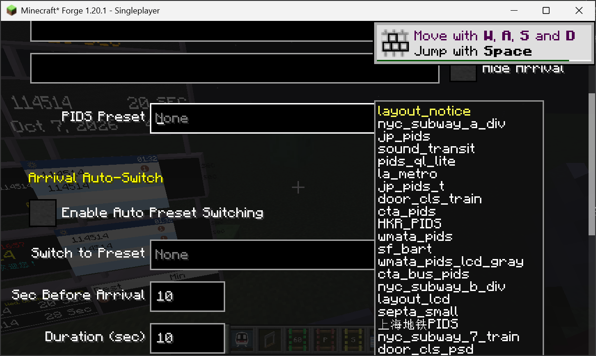
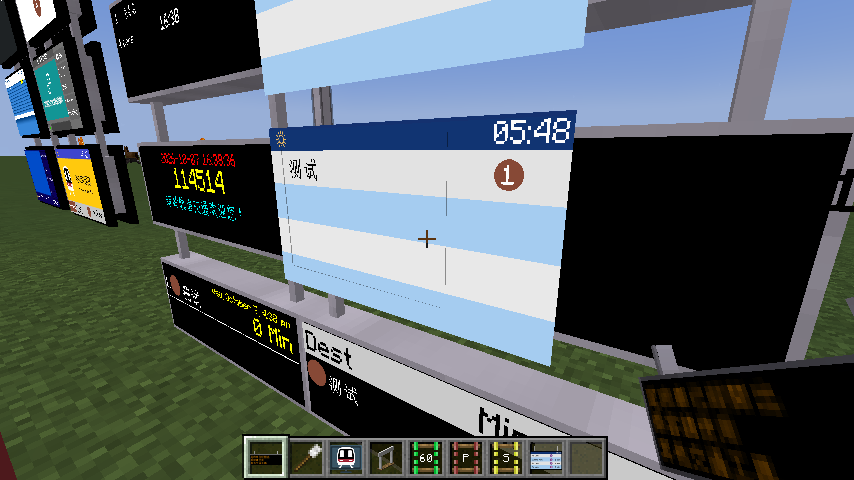
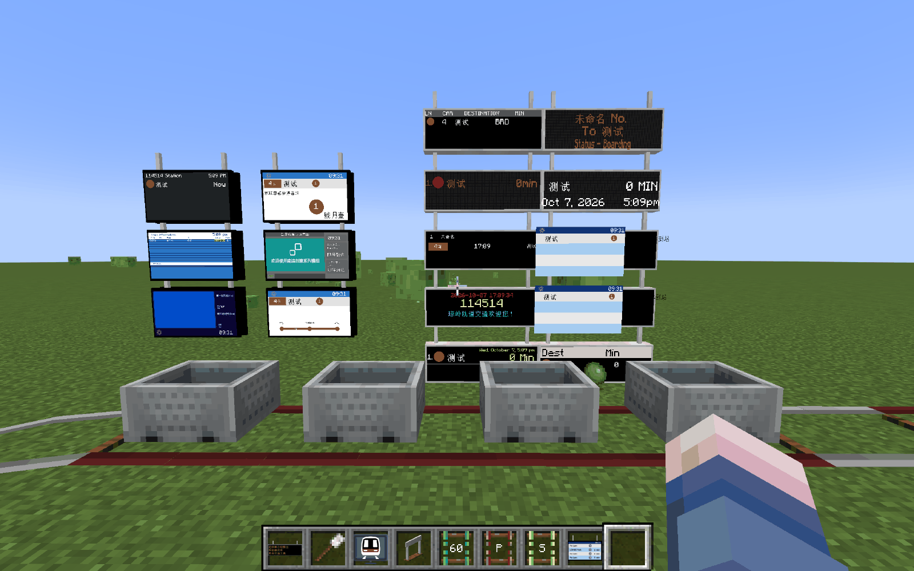

# Yomi's Joban Client Mod-JSPIDS

**English** | [中文](README_CN.md)

An unofficial version of Joban Client Mod.

Only 1.20(.1).

Yomi's Joban Client Mod (Abbreviated as YJCM) is an addon based on [Minecraft Transit Railway](https://github.com/jonafanho/Minecraft-Transit-Railway) Mod, adding various blocks from the Hong Kong MTR and utility blocks that will greatly improve your world.

Some of the blocks this mod adds including custom signal light, fare saver machine, the Railway Vision PIDS and more! 


> [!IMPORTANT]
> ## License
> This repository contains code from **two different sources**:
>
> | Part | License | Copyright |
> |---|---|---|
> | JCM (Joban Client Mod) code | MIT (see [LICENSE_JCM](LICENSE_JCM)) | AmberFrost, StrikeSNC, AozoraSky |
> | YJCM original code (written by Yomi) | All Rights Reserved (see [LICENSE](LICENSE)) | Yomi (Yomi_307) |
>
> - The JCM portion may be used, modified, and distributed under the MIT License.
> - The YJCM-specific code is **NOT open source**. Copying, redistributing, or modifying it without permission is prohibited.
> - If you fork this repository, you must keep both license files and this notice.

## Version differences

Upstream's Joban Client Mod comes in three variants, and it is worth knowing which one this fork is --
the answer decides whether a resource pack or a preset written for one of them will work here.

| Variant | For | Game versions | Upstream | This fork |
|---|---|---|---|---|
| **v1** | MTR 3 | Fabric / Forge 1.16.5 – 1.20.1 | no longer supported | **the base** — YJCM is a v1 fork |
| **v2** | MTR 4 | Fabric / Forge 1.16.5 – 1.20.4 | the supported line | its PIDS system is what this fork backports |
| **neo** | NeoMTR (an MTR 3 derivative) | Fabric / NeoForge 1.21.1 | semi-supported | not what this fork targets |

The JSPIDS in the version number is that backport: **v2's PIDS system running on v1** -- JavaScript
presets, component layouts, the PIDS Projector, and the scripting API they are written against.

MTR 3 here means the **YMTR** line, on Minecraft 1.20.1. Upstream only develops v2 (MTR 4) now, so if you
are on MTR 3 this fork is the line that still gets PIDS work.

If you are new to MTR or JCM and have no world yet, upstream's advice is the right one: start from MTR 4
and JCM v2. This fork is for the worlds, stations and resource packs that are already on MTR 3.

## What this fork changes

> [!WARNING]
> Most of this branch was written by **DeepSeek**, an AI agent, checking its own work
> against the game rather than following a specification. It is **not guaranteed to be
> compatible** with every resource pack or world, and it is **not guaranteed to be stable**.

The branch **`feat/jcm-pids-components`** ports **JCM 2.x / MTR 4's PIDS system** onto
**YJCM for MTR 3** (Minecraft 1.20.1, YMTR 3.6.3) — and then fixes some of the problems
that putting those panels into a world turned up. A PIDS preset either lays out correctly
on a real block or it does not, and only the game can say which.

Full write-up, in Chinese, with the decompiled evidence and the in-game logs:
**[MTR3-PIDS-PORT.md](MTR3-PIDS-PORT.md)**. This section is the summary.

### Added

| | |
|---|---|
| Component layouts | `com.jsblock.pids` — 11 components; a resource pack declares the layout in JSON (`components`) |
| JavaScript presets | `com.jsblock.script` — embedded Rhino 1.7.15; a JCM 2.x `.js` preset runs **unmodified** (`scriptFiles`) |
| Script sandbox | class-access allow-list, a warning screen before switching it off, player-facing failure notices, a debug overlay |
| 1A PIDS presets | `jsblock:pids_1a` gets the preset storage, auto-switch and config screen the LCD/RV PIDS already had |
| Textures | JCM 2.x's PIDS artwork (`weather_*`, `plat_circle`, `rv_default`, `black`) |
| Checks | `tools/run-pids-check.ps1` — three headless checks that run real presets through the real engine |
| Diagnostics | `-Djsblock.pids.trace=true` logs every draw call a preset issues, with type, depth, colour and text |
| Docs | `MTR3-PIDS-PORT.md` |
| PIDS Projector | `jsblock:pids_projector` — JCM 2.x's projector: the panel hangs in the air, with its own format, offset, rotation, scale, per-row text and hide-platform switch |

A preset that declares neither `components` nor `scriptFiles` keeps the old hard-coded
render path, unchanged.

### PIDS Projector

JCM 2.x's PIDS Projector is ported: `jsblock:pids_projector` throws a passenger information panel into
the air, wherever you point it.

| | |
|---|---|
| Placement | Offset, rotation and scale — one projector places a panel several blocks away, tilted, at any size |
| Content | A display format (preset), MTR's platform filter, per-row custom text, per-row hide, hide platform numbers |
| Presets | Every kind: a JCM 2.x `.js` preset, a JSON `components` layout, and the traditional texture-only packs |
| Aiming | Hold the brush and the panel is outlined; while the projector is unrotated, JCM 2.x's four red projection lines show the area it will cover |
| Screen | Right-click with the brush. It opens showing what the panel currently displays, so the fields are never blank |

The panel is not a block and has no collision — the projector block is what you aim at.

The panel's text is what a scripted preset reads back through `pids.getCustomMessage(i)`, and the hidden
rows through `pids.isRowHidden(i)`.

**A traditional pack's panel is drawn at the built-in size**, which is not the scripted canvas: the two
were sized by different parts of JCM 2.x. Scripted and components presets fill the canvas the projector's
scale is applied to; the built-in artwork follows the same offset, rotation and scale.

### Upstream defects fixed — the fork does not build without these

| | |
|---|---|
| `ForgeConfig.java` missing | referenced by `JobanForge`, never committed upstream |
| Gradle 8 | `classifier` was removed; now `archiveClassifier` |
| `font` vs `fonts` | the preset reader used `fonts`, every renderer used `font`, so the key was silently dropped |

### Rendering defects found in game

| Symptom | Cause |
|---|---|
| Weather icon as a white square; the panel background flickering | script textures went through the opaque render layer; JCM 2.x uses a translucent one |
| Route-number / car-count badge with no background, platform circle showing only its number, route-map bar and station dots missing | `.color()` takes a six-digit RGB and MTR 3 reads the alpha straight out of it; JCM 2.x adds `ARGB_BLACK` first |
| Text growing on every marquee pass, then scrolling outside the panel | the scroll was implemented as leading spaces, so it took part in the width measurement |
| Whole panel ~40% off to the left | the panel origin was derived from the panel size instead of copied from JCM 2.x's hard-coded literals |
| Every two-block PIDS showing on one side only | one half was skipped; JCM 2.x draws from both, one face each |
| A 1A panel painting twice, or not at all | `pids.isKeyBlock()` was hard-coded, so the preset could not tell the halves apart |
| CJK drawn at half the size its own box reserved | the layout and the draw used two different CJK multipliers |

### Data defects found in game

| Symptom | Cause |
|---|---|
| Empty rows filled with "not in service", each with a permanent "1 min" that flips between languages | `arrivals().get(i)` returned a placeholder object past the end of the list instead of `null`, so a preset's own null check never fired |
| `pids.station()` null on every panel that auto-detects its platform | the lookup was handed the `null` world its guard rejected — which also made the route map always start at the first stop |
| `Route.getDestination` returning nothing on most routes | MTR 3 only reads per-stop custom destinations; MTR 4 falls back to the terminus |

A preset that indexes past the end without checking now throws, as it does in JCM 2.x —
and the engine recovers the frame by retrying it once with a placeholder, because a
resource pack is not something the mod can edit. The throw stays in the log; the player
gets one line, and gets the red error only when the retry could not save the panel.

### Pixelation

A preset can be drawn small and magnified, so its text and icons land on one coarse grid — the look
of a dot-matrix or an LCD board. It is off unless somebody asks for it, and there are two people who
can:

| Who | Where | What |
|---|---|---|
| The player | `config/jsclient.json` → `"pixelScaleByPreset": { "preset-id": 3 }` | how coarse, per preset; `1` refuses a pack's request |
| The player | `"pixelShapeByPreset": { "preset-id": "circle" }`, or `"pixelShapeDefault": "circle"` | which grid, per preset or for all of them |
| The pack | per preset: `"pixelScale": 3`, `"pixelShape": "circle"` | what it drew for |
| The pack | per preset or pack-wide: `"pixelResolution": 96` (dots across), `[96, 54]`, or `{"width": 96, "height": 54}` | the board it was drawn for, when a divisor is not accurate enough |
| The pack | `"pixelDots": [68, 38]` (or `dots` pack-wide) | how many lamps the board has, when the picture should be finer than the dots |
| The pack | top level of `joban_custom_resources.json` | the same, once for every preset it has |

```json
"pixelation": { "enabled": true, "scale": 3, "shape": "circle" }
```

`enabled: false` is a pack saying it wants none of its presets pixelated — which, before 2.1, it had
no way to say. The player's entry still wins, including when it says `1`.

> **Pack authors: the full guide is [docs/pixelation-guide.md](docs/pixelation-guide.md)** — every key, the exact proportions of the three canvases, and which dot counts look like what.

A resolution is the more precise of the two ways to ask: a scale is a divisor, so it only lands on
grids that divide the canvas evenly. **The proportions of the grid always come out the canvas's** --
the width is read as the intent and the height recomputed from it, because the magnified target is
stretched across the panel and a grid with the wrong ratio is a squashed picture. A `96` on a 136x76
canvas becomes `96x54`, and one log line says so when that differs from what was asked for.

`square` draws pixels edge to edge and is both the default and what 1.4 drew; `circle` draws round
dots with a dark gap between them, one mask cell per offscreen pixel, which costs one extra quad per
panel rather than a second pass. A preset that leaves part of its canvas transparent is the one case
`circle` does not suit: the gaps are painted wherever the mask is, and there is no per-pixel alpha to
test against without reading the target back.

### Script API coverage

Measured against the official scripting docs, <https://jcm.joban.org/v2.2/dev/scripting/>, rather
than against whichever presets happened to be tested. Those pages document **515 API entries**;
this is where the branch stands against them.

The comparison is mechanical: every `Class.method(...)` row is scraped from the 37 documentation
pages, the port's own members come from `javap -public` over the built jar (nested classes and
inherited members included), and the two are diffed.

**Implemented** -- the globals a PIDS script can reach:

| | |
|---|---|
| Drawing | `Text` `Texture` `Rectangle` `Vector3f` `Matrices` |
| Timing & state | `Timing` `StateTracker` `CycleTracker` `RateLimit` |
| Resources | `Resources` (incl. `getMTRVersion`, `getAddonVersion`, `readBufferedImage`) `TextUtil` |
| World | `MinecraftClient` `MinecraftClient.localPlayer()` `PlayerEntity` |
| MTR client data | `MTRClientData` (= `mtr.client.ClientData`: `STATIONS` / `PLATFORMS` / `SCHEDULES_FOR_PLATFORM` / `DATA_CACHE`. **Not** a second name for `MinecraftClient` — see below) |
| Declarative components | `ctx.parseComponent(json)` -> `render(ctx)` / `canRender()` / `x()` / `y()` / `width()` / `height()` / `type()`, or `ctx.draw(component)` |
| Runtime canvas | `GraphicsTexture(w, h)`: `graphics` / `bufferedImage` / `identifier`, `upload()`, `close()`, `clear` / `fillRect` / `drawText` / `measureText` / `drawTexture` |
| Slow work | `BackgroundWorker` `Networking` `NetworkResponse` `DataReader` |
| Persistent state | `Files`: `read` / `readData` / `saveData` / `deleteData` / `hasData` — v2's `FilesUtil`, same names, same signatures, same two roots (`<game dir>` and `<game dir>/data/mtrscripting`) |
| Sound | `ctx.getSoundManager()` `SoundManager` `TickableSoundInstance` |
| Misc | `console` `print` `include` `SCRIPT_INPUT` |
| The panel | `pids.*`, `arrivals().*`, `arrival.*`, `pids.station()`, `route().getPlatforms()`, `ctx.setAutoZOrdering()` `ctx.setZOrderStep()` |
| Fork-only | `arrival.routeType` and `arrival.isLightRailRoute` (MTR 3's `Route.routeType`: `NORMAL` / `LIGHT_RAIL` / `HIGH_SPEED`). MTR 4 has no route type, and **neither version has express versus local as a flag** — the packs that care put the service type in the route's **number** and keyword-match it (see HKR's `getColorByKeyword`). On MTR 3 a route's number is gated behind the checkbox MTR labels *Has Route Number*, so that checkbox is what makes those colours appear here |

**Still missing, by group.** Roughly 149 entries, none of which a PIDS preset is known to call;
they are listed here so a pack author can tell at a glance rather than by experiment. The count and
this list were re-measured against the real packs: every `Resources.read*` call site in the library
is in `assets/mtr/**` — MTR's own map and LCD scripting host, not PIDS — so the PIDS-side gap is
zero. See `V2-API-覆盖表.md`.

*Classes that exist, with methods not yet added (81 entries):*

| Class | Missing |
|---|---|
| `Resources` | `read` `readString` `readFont` `idr` `exist` `manager` `getNTEVersion` `getNTEVersionInt` `getNTEProtoVersion` `getSystemFont` `hasSystemFont` `ensureStrFonts` `getFontRenderContext` |
| `Station` | `getZone1/2/3`, `getMinX/Y/Z`, `getMaxX/Y/Z`, `getExits`, `inArea`, `isTransportMode`, `getCenter` -- needs the station's geometry, which the wrapper does not carry |
| `Stop` | `distance` `dwellTime` `dwellTimeMillis` `platform` `destinationName` `destinationStation` `customDestination` and 6 more |
| `PlayerEntity` | `activeItem` `mainHandItem` `offHandItem` `yaw` `pitch` `bodyYaw` `isSneaking` `isSprinting` `isSwimming` `isHoldingItem` `playerName` |
| `Platform` | `getId` `getHexId` `getName` `getMidPosition` `getDwellTime` `containsPos` `routes` `routeColors` |
| `MinecraftClient` | `blockLightAt` `skyLightAt` `getRedstoneLevel` `getScoreboardScore` `getWorldPlayers` `spawnParticleInWorld` |
| `DataReader` | `asInputStream` `openInputStream` `asByteArray` `asBufferedImage` `asFont` |
| `SimplifiedRoute` | `getId` `getColor` `getCircularState` `getPlatformIndex` |
| `NetworkResponse` | `success` `exception` `getHeaders` |
| `SimplifiedRoutePlatform` | `getDestination` `getStationId` |
| `PIDSScriptContext` | `getRenderManager()` (3D model rendering), `setDebugInfo()` |

*Classes not implemented at all (68 entries):*

| Class | Entries | Note |
|---|---|---|
| `VanillaText` | 11 | rich text for `displayMessage(VanillaText, ...)` |
| `Siding` `PathData` `Vector` `Position` `Rail` | 43 | TSC data, reached from *vehicle* scripting in practice |
| `VoxelShape` `ItemStack` `TransportMode` `UtilitiesClient` | 11 | odds and ends |
| `StationExit` | 2 | station exits |
| `CarDetails` | 1 | `getVehicleId()` -- MTR 3 does not stream per-car data to the client, so `cars()` returns an empty list on purpose |

(`Files` used to be listed here; it is implemented now, as the persistent-state row above.)

*Out of scope: a different script type (18 classes, ~162 entries).* `VehicleWrapper`,
`VehicleScriptContext`, `VehicleExtraData`, `EyecandyWrapper`, `EyecandyScriptContext`,
`RenderManager`, `ModelManager`, `Model`, `RawModel`, `RawMeshBuilder`, `DynamicModelHolder`,
`QuadDrawCall`, `DisplayHelper`, `BlockUseEvent`, `EyecandyEvents`, `ModelData`,
`Vehicle`. These belong to Vehicle Scripting and Eyecandy Scripting rather than to PIDS.
(`GraphicsTexture` used to be listed here; it is implemented now, as the runtime canvas below.)

If a pack needs one of these, the first four groups are the cheap ones -- a few lines each, and
`Resources.read*` is the group most likely to matter, since it is how a pack loads its own files.

### Scripting: declarative components and a runtime canvas

Two JCM 2.x abilities this branch did not have, both wired up under v2's own names and parameter
shapes.

**Components from a script.** v2's only entry into its component system is
`ctx.parseComponent(jsonString)`, and the declaration it takes is byte-for-byte what a preset's
`components` array holds:

```js
function render(ctx, state, pids) {
    Texture.create("Bg").texture("mypack:pids/board.png").size(pids.width, pids.height).draw(ctx);

    // A clock at (4, 2), 40x10 -- the same declaration a JSON preset would carry.
    const clock = ctx.parseComponent('{"component":"clock","x":4,"y":2,"width":40,"height":10,"format":"HH:mm"}');
    if (clock.canRender()) {
        clock.render(ctx);        // ctx.draw(clock) is equivalent
    }

    // An arrival row; `row` means the same display row it means in JSON.
    const row = ctx.parseComponent('{"component":"arrival_destination","x":4,"y":14,"width":80,"height":12,"row":0}');
    row.render(ctx);
}
```

A component offers `render(ctx)`, `canRender()`, `x()` / `y()` / `width()` / `height()` and `type()`.
A declaration that cannot be used — malformed JSON, an array, no `component` key, an unknown type —
is refused with a message that lists the known types; the panel falls back to its preset background
rather than going black.

**A canvas the script draws into.** Then it is an ordinary texture:

```js
function create(ctx, state, pids) {
    state.canvas = new GraphicsTexture(128, 32);          // allocated only when actually used
    state.canvas.fillRect(0, 0, 128, 32, 0x101010);
    state.canvas.drawText("06:00", 4, 4, 0xFC9700, 20);
    state.canvas.drawTexture("jsblock:textures/block/pids/plat_circle.png", 100, 4, 24, 24);
    state.canvas.upload();
}

function render(ctx, state, pids) {
    Texture.create("Board").texture(state.canvas.identifier).pos(0, 0).size(128, 32).draw(ctx);
}

function dispose(ctx, state, pids) {
    state.canvas.close();                                  // required: a texture is not collected
}
```

Coordinates are the canvas's own pixels; colours are ARGB (`0xRRGGBB` means opaque, `0` means
transparent). A script may hold 64 unreleased canvases before the next one is refused by name, and a
resource reload releases whatever was left open. The canvas is an ordinary texture as far as the
pixelation pass is concerned — nothing is nested offscreen.

**`MTRClientData` and `MinecraftClient` are two different things.** In JCM 2.x `MTRClientData` is
MTR's own client data (its bytecode reads `class mtr/client/ClientData`) while `MinecraftClient` is
the world-state helper (`MinecraftClientUtil`). This branch wires them the same way:

```js
const station = MTRClientData.STATIONS.get(someId);   // stations, platforms, arrival lists
const raining = MinecraftClient.worldIsRaining();     // world state
```

**A script cannot read outside its own resource pack.** `include()` and `Texture.texture(...)` both
validate before anything is opened and refuse `..`, a leading `/`, a backslash and a drive letter —
`include("jsblock:../../../../secret.js")` is refused with one console line and one chat line, and
the script carries on. That guard came with the new read paths rather than after them.

### When a resource pack's PIDS does not work

If a resource pack's PIDS does not work, send me the **game version**, the **game log** and a
**link to the resource pack**, or open an
[issue](https://github.com/ChihayaAnonQWQ/Yomis-Joban-Client-Mod/issues/new).

- **Game version**: Minecraft, MTR / YMTR, and this mod (currently `1.2.12-JSPIDS-2.0`)
- **Game log**: `logs/latest.log`. A failing panel writes one line,
  `[Joban Client] PIDS script "..." threw in render(): ...`, which names the preset, the script line
  and the API that was missing -- usually enough to fix it without reproducing anything
- **Pack link**: the pack's name or download address, so its presets can be pulled out and run
  through the headless checks

### Config screen

The preset selection box was drawn under its text field and covered the rows below, while
those rows drew their labels on top of it — so neither could be read. It is drawn **beside**
the field now, with a background and a border, which is what the screenshot below shows.
Both PIDS config screens share the widget, so both are fixed.



### Known issues

- **A 1A PIDS with no preset selected is drawn in the Railway Vision PIDS style.** The 1A
  passenger information display had to be moved onto YJCM's RV renderer for it to take part
  in the preset system, and a block with no preset selected falls back to that renderer's own
  layout. **Workaround:** use the brush on the block and switch "PIDS Preset" to any display
  format a resource pack provides — from then on the panel is drawn by the preset, not by the
  built-in layout.



The light blue striped boards in the station below are the ones with no preset selected:



### Building MTR 3 against this branch

MTR's development jars (`MTR-common-1.20-*-dev.jar`) are 404, so the build uses a
Mojang-mapped MTR 3 jar instead:

```
~/.gradle/caches/forge_gradle/deobf_dependencies/maven/modrinth/ymtr/
    1.20.1-3.6.3_mapped_official_1.20.1/ymtr-1.20.1-3.6.3_mapped_official_1.20.1.jar
```

Copy it to `checkouts/1.20/mtr-common.jar` (and `mtr-fabric.jar` / `mtr-forge.jar`;
the three are identical). `checkouts/` is git-ignored.

```powershell
$env:JAVA_HOME = 'C:\Program Files\Zulu\zulu-21'
gradle build --no-daemon --console=plain --max-workers=1        # -> build/MTR-YJCM-1.20-*.jar
.\tools\run-pids-check.ps1                                       # headless checks, non-zero on failure
```

A long stack trace during configuration is `build.gradle`'s `setupFiles` catch branch
printing a failed `Minecraft-Mappings` download; it is not a build failure.

## FAQ & Support
### Why does my game crash?
There's a variety of reasons, one of the main reasons is that <b>you're using the wrong version of the MTR Mod</b>.  
Version labeled as <u>Pre-release</u> should only be used with a preview version of MTR Mod [in their Discord](https://discord.gg/hvddbya8rh).  
If you're unable to download the preview version of MTR, please download the versions labeled as <u>Release</u>.

### The game still crashes / I want to report a bug / I want to give suggestions
Most of the support are done in our Discord for easier communication, please join our [Discord Server](https://discord.gg/FNc2rgWmP2) here.

### I want to know more!
We have documented most parts of the mod in our [wiki](https://www.joban.tk/wiki/JCM:Joban_Client_Mod).

## Setup

1. Clone this repository
2. Sync the Gradle project
3. On First run:
   1. Sync the Gradle Project
   2. After finishing, Sync the Gradle Project again
   3. Restart IntelliJ IDEA

## Updating MTR Mod
MTR Mod is a required dependencies of Joban Client Mod.

To update MTR Mod to the latest version in your dev environment, run the `setupLibrary` task.

## Cross version development
We now use [Manifold](https://github.com/manifold-systems/manifold), which also supplies a preprocessor to conditionally apply java code.

A `MC_VERSION` is passed to the preprocessor, and it will look something like `11904`:  
- The 1st digit is the major version (1)
- The 2nd - 3rd digit is the main version (19 for 1.19)
- The 3nd - 4th digit is the minor version (04 for 1.19.4)

For example, if you want to apply code for 1.19.3 and above, but not anything else:
```
   #if MC_VERSION >= "11903"
      LOGGER.info("This line will appear in 1.19.3 and above")
   #else
      LOGGER.info("This line will appear in 1.19.2 or below")
   #endif
```

## Troubleshooting
### Command line is too long. Shorten the command line and rerun.
Enable Shorten Command Line (Edit Configuration)


### Modules generated_XXXXXX and jsblock export package com.jsblock to module architectury
<b>Currently only Forge 1.16.5 works</b>

### Everything goes wrong, error after error
1. Delete `.gradle` folder in your user account folder
2. <b>[IMPORTANT]</b> commit and push any uncommited files
3. Delete the entire Joban Client Mod folder
4. Re-clone the project
